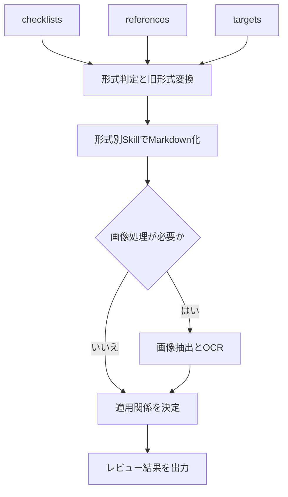

# CodexSkills-review

Windows 11 上の Codex で、Excel、Word、PowerPoint、PDF、画像を読み取り、Markdown へ変換し、必要に応じてファイルを編集する、配布可能なスキルリポジトリの要件定義です。

設計書レビューでは、対象ファイルとチェックリストを先に Markdown へ変換し、生成された Markdown をレビュー対象にします。編集を依頼された場合は、形式ごとの Python ライブラリを使って編集済みファイルを出力します。

このリポジトリには、利用者向けの `README.md`、Codex の共通指示を記載する `AGENTS.md`、完成した Skill 群、入力用フォルダ、作業用フォルダ、出力用フォルダを配置します。`README.md` は利用手順であると同時に、Skill Creator が `AGENTS.md` と全 Skill を作成するための正本とします。

入力ファイル、作業中間物、編集済みファイル、レビュー結果は利用者の端末上で扱い、Git へは通常コミットしません。リポジトリをコピーまたはクローンした利用者が、決められたフォルダへファイルを置くだけでレビューを開始できる構成にします。

## 目次

1. [目的](#1-目的)
2. [基本方針](#2-基本方針)
3. [対応形式](#3-対応形式)
4. [作成する Skill](#4-作成する-skill)
5. [使用するライブラリ](#5-使用するライブラリ)
6. [Windows 11 へのインストール](#6-windows-11-へのインストール)
7. [作業フォルダ構成](#7-作業フォルダ構成)
8. [ファイル読み取りと Markdown 変換](#8-ファイル読み取りと-markdown-変換)
9. [ファイル編集](#9-ファイル編集)
10. [YAML フロントマター](#10-yaml-フロントマター)
11. [設計書レビュー](#11-設計書レビュー)
12. [旧 Office 形式の扱い](#12-旧-office-形式の扱い)
13. [形式別の要件](#13-形式別の要件)
14. [テストと完了条件](#14-テストと完了条件)
15. [Skill Creator への実装指示](#15-skill-creator-への実装指示)

## 1. 目的

次の作業を Codex から一貫して実行できるようにします。

1. Excel、Word、PowerPoint、PDF、画像の内容を読み取る。
2. 各ファイルをレビューしやすい Markdown へ変換する。
3. 画像とスキャン PDF に含まれる日本語・英語の文字を OCR で抽出する。
4. Excel 形式のチェックリストと、必要に応じて与えられる参考資料を読み取る。
5. 生成した Markdown を使って設計書をレビューする。
6. ユーザーの指示に基づき、元の形式を保った編集済みファイルを作成する。
7. 旧 Office 形式は、Microsoft Office を使って新形式へ変換してから処理する。

### 1.1 利用者向けクイックスタート

初回だけ、リポジトリのルートで Codex に次のように依頼します。

```text
このREADMEを正本として、ルートのAGENTS.mdとskills/配下の全Skillを作成し、各Skillを検証してください。
```

Skill と `AGENTS.md` の作成後は、次の順で利用します。

1. レビューのチェックリストを `input/checklists/` へ置く。
2. チェックリストから参照する基準書、規約、参考資料を `input/references/` へ置く。
3. レビュー対象の設計書や画像を `input/targets/` へ置く。
4. Codex に次のように依頼する。

```text
input/checklists、input/references、input/targetsを使ってレビューを実行し、結果をoutput/reviewsへ保存してください。
```

5. レビュー結果を `output/reviews/` で確認する。
6. 元ファイルへの反映も依頼した場合は、編集済みファイルを `output/edited/` で確認する。

## 2. 基本方針

1. Windows 11 上の Codex で動作させる。
2. 作業フォルダを他の利用者へ渡せるよう、設定と成果物のパスは相対パスにする。
3. `.xlsx`、`.docx`、`.pptx`、`.pdf`、画像ごとに独立した Skill を作る。
4. 各形式の Skill は、読み取り、Markdown 変換、編集の3つを担当する。
5. 文書の役割は、`input/checklists/`、`input/references/`、`input/targets/` の配置場所で明確にする。
6. レビューの前に、3つの入力フォルダにある対応ファイルをすべて Markdown へ変換する。
7. AI は生成済み Markdown を使って、チェック項目、参照資料、レビュー対象の適用関係を判断する。
8. Office/PDF 内の画像も抽出し、OCR を実行する。
9. レビュー結果は `output/reviews/`、編集済みファイルは `output/edited/` へ保存する。
10. 通常の処理では `input/` に置いたファイルを上書きしない。
11. ライブラリは、無償で利用でき、商用利用可能なものを使用する。
12. LibreOffice は使用しない。

## 3. 対応形式

| 入力形式 | 読み取り | Markdown 変換 | 編集 | 処理方法 |
|---|---:|---:|---:|---|
| `.xlsx` | 対応 | 対応 | 対応 | `openpyxl` |
| `.docx` | 対応 | 対応 | 対応 | `python-docx` |
| `.pptx` | 対応 | 対応 | 対応 | `python-pptx` |
| `.pdf` | 対応 | 対応 | 一部対応 | `pypdf`、`pdfplumber`、`reportlab` |
| `.png/.jpg/.jpeg` | 対応 | 対応 | 対応 | `Pillow`、`pytesseract`、Tesseract OCR |
| `.tif/.tiff` | 対応 | 対応 | 対応 | `Pillow`、`pytesseract`、Tesseract OCR |
| `.bmp/.webp` | 対応 | 対応 | 対応 | `Pillow`、`pytesseract`、Tesseract OCR |
| `.xls` | 対応 | 対応 | 対応 | Microsoft Excel で `.xlsx` へ変換後に処理 |
| `.doc` | 対応 | 対応 | 対応 | Microsoft Word で `.docx` へ変換後に処理 |
| `.ppt` | 対応 | 対応 | 対応 | Microsoft PowerPoint で `.pptx` へ変換後に処理 |

初版では、マクロ付き形式、パスワード付きファイル、破損ファイル、SVG、動画、手書き文字専用 OCR は対象外とします。

画像と画像だけで構成された PDF は OCR の対象です。OCR で読み取れない文字や、図形、矢印、線、色だけで表現された意味は推測せず、Markdown に `要確認` として記録します。

PDF は Office ファイルのように任意の文章やレイアウトを自由に書き換えられる形式ではありません。初版の PDF 編集は、ページの追加・削除・並べ替え・回転、結合・分割、メタデータ、フォーム、注釈、文字や図形の追記を対象とします。本文そのものを大きく修正する場合は、可能であれば変換元の Word、Excel、PowerPoint を編集して PDF を再作成します。

## 4. 作成する Skill

| Skill 名 | 主な役割 | 入力 | 出力 |
|---|---|---|---|
| `xlsx-document` | XLSX の読み取り、Markdown 変換、編集 | `.xlsx` | `.md` または編集済み `.xlsx` |
| `docx-document` | DOCX の読み取り、Markdown 変換、編集 | `.docx` | `.md` または編集済み `.docx` |
| `pptx-document` | PPTX の読み取り、Markdown 変換、編集 | `.pptx` | `.md` または編集済み `.pptx` |
| `pdf-document` | PDF の読み取り、Markdown 変換、対応可能な編集 | `.pdf` | `.md` または編集済み `.pdf` |
| `image-document` | 画像の読み取り、OCR、Markdown 変換、編集 | 対応画像形式 | `.md` または編集済み画像 |
| `convert-legacy-office` | 旧 Office 形式を新形式へ変換 | `.xls/.doc/.ppt` | `.xlsx/.docx/.pptx` |
| `review-markdown-documents` | Markdown 化されたチェックリスト、参考資料、対象をレビュー | 役割別の `.md` 一式 | `output/reviews/` のレビュー結果 |
| `review-documents-orchestrator` | 3つの入力フォルダから変換、対応付け、レビューを順番に実行 | `input/checklists/`、`input/references/`、`input/targets/` | `work/` の中間物と `output/` の成果物 |

形式ごとの読み取り、変換、編集を1つの Skill にまとめます。読み取り用 Skill、OCR 用 Skill、編集用 Skill を別々に増やさず、画像処理は `image-document` にまとめます。

## 5. 使用するライブラリ

### 5.1 直接使用するライブラリ

| ライブラリ | 対象 | 読み取りで使う機能 | 編集で使う機能 | ライセンス | 料金 | 商用利用 | 注意事項 |
|---|---|---|---|---|---|---|---|
| `openpyxl` | XLSX | シート、セル、数式、スタイル、コメント、結合セルなど | セル値、数式、書式、シート、コメント、画像、グラフなど | MIT | 無料 | 可 | Excel の計算エンジンではないため、数式の再計算は行わない |
| `python-docx` | DOCX | 段落、見出し、表、スタイル、画像関係など | 文章、段落、表、スタイル、画像、セクションなど | MIT | 無料 | 可 | 変更履歴や一部の高度な Word 機能は直接扱えない |
| `python-pptx` | PPTX | スライド、図形、テキスト、表、画像、ノートなど | テキスト、図形、表、画像、配置、サイズ、スライドなど | MIT | 無料 | 可 | SmartArt、アニメーションなどは完全には編集できない |
| `pypdf` | PDF | ページ、テキスト、メタデータ、フォームなど | 結合、分割、回転、ページ操作、メタデータ、フォーム、注釈など | BSD-3-Clause | 無料 | 可 | 既存本文の自由な書き換えには向かない |
| `pdfplumber` | PDF | ページごとのテキスト、単語、表、座標など | 原則として読み取りに使用 | MIT | 無料 | 可 | スキャン PDF の OCR は `image-document` を呼び出す |
| `reportlab` | PDF | 既存 PDF の解析には使用しない | 新しい PDF、追記用ページ、文字・図形の重ね合わせを作成 | BSD | 無料 | 可 | 既存 PDF への反映は `pypdf` と組み合わせる |
| `Pillow` | 画像 | PNG、JPEG、TIFF、BMP、WebP、画像情報、複数フレームなど | 切り抜き、回転、リサイズ、色調補正、文字・図形の追記、形式変換 | MIT-CMU | 無料 | 可 | SVG と動画は対象外 |
| `pytesseract` | 画像・スキャン PDF | Tesseract OCR を呼び出し、文字、位置、信頼度を取得 | 画像自体の編集には使用しない | Apache-2.0 | 無料 | 可 | OCR エンジン本体と日本語言語データを別途使用する |
| `pywin32` | 旧 Office | Microsoft Office の COM API を呼び出す | `.xls/.doc/.ppt` の変換と、必要な Office 操作 | 複数の許諾ライセンス | 無料 | 可 | Windows とインストール済み Microsoft Office が必要。同梱ライセンス文書に従う |

OCR エンジンには、Python ライブラリとは別に Tesseract OCR を使用します。Tesseract OCR と公式言語データは Apache-2.0 で、無償かつ商用利用可能です。初版では、通常の日本語 `jpn`、英語 `eng`、日本語縦書き `jpn_vert` を使用します。

### 5.2 主な依存関係

依存ライブラリは `pip` が自動的にインストールします。Skill のコードから直接利用しない依存ライブラリを、個別にインストールする手順は作りません。

| 親ライブラリ | 主な依存ライブラリ | 主な用途 |
|---|---|---|
| `openpyxl` | `et-xmlfile` | XLSX 内の XML 処理 |
| `python-docx` | `lxml`、`typing-extensions` | DOCX 内の XML 処理、型補助 |
| `python-pptx` | `lxml`、`Pillow`、`XlsxWriter`、`typing-extensions` | PPTX 内の XML、画像、グラフデータ処理 |
| `pdfplumber` | `pdfminer.six`、`Pillow`、`pypdfium2` | PDF テキスト解析、画像、ページ描画 |
| `reportlab` | `Pillow`、`charset-normalizer` | 画像と文字コード処理 |
| `Pillow` | 追加必須依存なし | 画像の読み取りと編集 |
| `pytesseract` | `Pillow`、`packaging` | OCR 入力画像とパッケージ情報の処理 |
| `pypdf` | 追加必須依存なし | PDF の基本操作 |
| `pywin32` | 追加必須依存なし | Windows API と COM 呼び出し |

依存関係はライブラリの更新によって変わる場合があります。実際にインストールされた一覧は、必要になったときだけ次のコマンドで確認します。

```powershell
py -3.12 -m pip list
```

## 6. Windows 11 へのインストール

### 6.1 前提

- Windows 11 64bit
- CPython 3.12 64bit
- `py` コマンドが利用できること
- `.xls`、`.doc`、`.ppt` を扱う場合は Microsoft Office デスクトップ版がインストールされていること
- 画像とスキャン PDF の OCR を行う場合は Tesseract OCR がインストールされていること

PowerShell を開き、Python を確認します。

```powershell
py -3.12 --version
py -3.12 -m pip --version
```

`pip` を更新します。

```powershell
py -3.12 -m pip install --upgrade pip
```

### 6.2 ライブラリを1つずつグローバルインストールする

XLSX 用ライブラリをインストールします。

```powershell
py -3.12 -m pip install openpyxl
```

DOCX 用ライブラリをインストールします。

```powershell
py -3.12 -m pip install python-docx
```

PPTX 用ライブラリをインストールします。

```powershell
py -3.12 -m pip install python-pptx
```

PDF の基本操作用ライブラリをインストールします。

```powershell
py -3.12 -m pip install pypdf
```

PDF のテキスト・表読み取り用ライブラリをインストールします。

```powershell
py -3.12 -m pip install pdfplumber
```

PDF の追記・生成用ライブラリをインストールします。

```powershell
py -3.12 -m pip install reportlab
```

画像の読み取り・編集用ライブラリをインストールします。

```powershell
py -3.12 -m pip install Pillow
```

OCR 呼び出し用ライブラリをインストールします。

```powershell
py -3.12 -m pip install pytesseract
```

旧 Office 形式用ライブラリをインストールします。

```powershell
py -3.12 -m pip install pywin32
```

### 6.3 Tesseract OCR と日本語言語データ

`pytesseract` は Tesseract OCR を呼び出す Python ラッパーです。OCR エンジン本体は `pip` ではインストールされないため、[Tesseract 公式のインストール案内](https://tesseract-ocr.github.io/tessdoc/Installation.html)に従って Windows 11 へインストールします。

インストール時またはインストール後に、次の公式言語データを利用できるようにします。

| 言語データ | 用途 |
|---|---|
| `jpn` | 横書きを中心とする日本語 |
| `eng` | 英語 |
| `jpn_vert` | 日本語縦書き |

言語データが同梱されていない場合は、Tesseract 公式の [`tessdata_fast`](https://github.com/tesseract-ocr/tessdata_fast) から対応する `.traineddata` を取得し、Tesseract の `tessdata` フォルダへ配置します。

PowerShell を新しく開き、Tesseract 本体と言語データを確認します。

```powershell
tesseract --version
tesseract --list-langs
```

一覧に `jpn`、`eng`、`jpn_vert` が表示されれば OCR の準備は完了です。Skill は PATH 上の `tesseract` コマンドを使用し、端末固有のインストール先をスクリプトへ直接記述しません。

### 6.4 インストール確認

```powershell
py -3.12 -c "import openpyxl; print('openpyxl: OK')"
py -3.12 -c "import docx; print('python-docx: OK')"
py -3.12 -c "import pptx; print('python-pptx: OK')"
py -3.12 -c "import pypdf; print('pypdf: OK')"
py -3.12 -c "import pdfplumber; print('pdfplumber: OK')"
py -3.12 -c "import reportlab; print('reportlab: OK')"
py -3.12 -c "from PIL import Image; print('Pillow: OK')"
py -3.12 -c "import pytesseract; print('pytesseract: OK')"
py -3.12 -c "import win32com.client; print('pywin32: OK')"
```

すべて `OK` と表示されれば準備完了です。

## 7. 作業フォルダ構成

```text
<スキルリポジトリ>/
├─ README.md
├─ AGENTS.md
├─ .gitignore
├─ skills/
│  ├─ README.md
│  ├─ xlsx-document/
│  ├─ docx-document/
│  ├─ pptx-document/
│  ├─ pdf-document/
│  ├─ image-document/
│  ├─ convert-legacy-office/
│  ├─ review-markdown-documents/
│  └─ review-documents-orchestrator/
├─ input/
│  ├─ checklists/
│  │  └─ README.md
│  ├─ references/
│  │  └─ README.md
│  └─ targets/
│     └─ README.md
├─ work/
│  ├─ README.md
│  ├─ converted-office/
│  ├─ images/
│  └─ markdown/
└─ output/
   ├─ edited/
   │  └─ README.md
   └─ reviews/
      └─ README.md
```

各 Skill フォルダは、次の基本構成にします。Skill フォルダ内には補助的な `README.md` を置かず、Codex が必要とするファイルだけを配置します。

```text
skills/<skill-name>/
├─ SKILL.md
├─ agents/
│  └─ openai.yaml
├─ scripts/
├─ references/   # 詳細資料が必要なSkillだけ
├─ assets/       # テンプレート等が必要なSkillだけ
└─ tests/
```

### 7.1 フォルダの役割

| フォルダ | 利用者が行うこと | 内容 |
|---|---|---|
| `skills/` | 通常は変更しない | Skill Creator が作成・検証した全 Skill を格納する |
| `input/checklists/` | チェックリストを置く | 原則として XLSX のレビュー項目表。複数配置可能 |
| `input/references/` | 必要な参考資料を置く | チェックリストが参照する規約、基準書、用語集、参考設計等 |
| `input/targets/` | レビュー対象を置く | XLSX、DOCX、PPTX、PDF、旧 Office 形式、対応画像形式 |
| `work/` | 通常は操作しない | 新形式化した Office、抽出画像、変換済み Markdown 等の中間物 |
| `output/reviews/` | 結果を確認する | 根拠、判定、修正案を含むレビュー結果と全体サマリー |
| `output/edited/` | 編集も依頼した場合に確認する | 結果を記入したチェックリストや編集済み対象ファイル |

各パスはリポジトリのルートを基準にした相対パスとして扱います。利用者ごとのユーザー名、ドライブ名、絶対パスを設定へ埋め込みません。入力フォルダでは、案件やシステム単位のサブフォルダを作成して構いません。

### 7.2 チェックリストから参考資料を参照する方法

チェックリストから参考資料を指定する場合は、リポジトリのルートを基準にした相対パスを記載します。

```text
input/references/security/security-guideline.pdf
```

ファイル名だけが記載されている場合は、`input/references/` 以下を再帰的に検索します。同名ファイルが複数ある場合や、指定された資料が見つからない場合は推測せず、レビュー結果を `要確認` として不足資料を記載します。

### 7.3 レビュー結果の配置

レビュー結果は、少なくとも次の構成で出力します。

```text
output/reviews/
├─ summary.md
├─ <対象ファイル名>_review.md
└─ <対象ファイル名>_findings.md   # 指摘一覧を分ける場合だけ
```

複数のチェックリストを使った場合は、各レビュー結果に使用したチェックリストと参考資料の相対パスを記載します。

## 8. ファイル読み取りと Markdown 変換

処理順序は次のとおりです。



1. `input/checklists/`、`input/references/`、`input/targets/` にある対応ファイルをフォルダ別に列挙する。
2. チェックリストとレビュー対象が1件以上あることを確認する。参考資料は0件でもよい。
3. ファイルの役割は配置フォルダから決定し、AI に役割分類させない。
4. `.xls`、`.doc`、`.ppt` は、`work/converted-office/` の新形式へ変換する。
5. 形式ごとの Skill で、本文、表、見出し、シート名、スライド番号などを読み取る。
6. 単独の画像は `image-document` で読み取る。Office/PDF 内の画像は `work/images/` へ抽出してから同じ Skill で扱う。
7. 画像だけで構成された PDF はページを画像化し、日本語・英語の OCR を実行する。
8. OCR では文字列に加え、ページまたは画像内の位置と信頼度を取得する。
9. `work/markdown/` にファイルごとの Markdown を作成し、先頭に YAML フロントマターを付ける。
10. チェックリストに記載された相対パスやファイル名から、`input/references/` の参考資料を対応付ける。
11. チェックリストに対象指定がある場合はそれに従い、ない場合は内容から適用するレビュー対象を判断する。
12. 変換済み Markdown を使ってレビューし、結果を `output/reviews/` へ保存する。

## 9. ファイル編集

編集処理は、ユーザーの編集指示を形式別 Skill が受け取り、編集済みファイルを作成する流れにします。

1. 対象ファイルと編集内容を確認する。
2. 対象形式のライブラリでファイルを開く。
3. 指定された箇所だけを変更する。
4. `output/edited/` に別名で保存する。
5. 保存したファイルを同じライブラリでもう一度開く。
6. 指定した変更が反映されていることを確認する。
7. 変更したファイル、変更箇所、出力先を Markdown で報告する。

編集済みファイル名は、元の名前へ `_edited` を付けます。

```text
input/targets/basic-design.xlsx
output/edited/basic-design_edited.xlsx

input/targets/system-diagram.png
output/edited/system-diagram_edited.png
```

同名ファイルがすでにある場合は、日時を付けて別名にします。

```text
output/edited/basic-design_edited_20260817-120000.xlsx
```

## 10. YAML フロントマター

生成する Markdown の先頭には、変換元ファイルの情報を記載します。

```yaml
---
source_path: "input/targets/basic-design.xlsx"
source_name: "basic-design.xlsx"
source_format: "xlsx"
document_role: "target"
converted_at: "2026-08-17T12:00:00Z"
converter_skill: "xlsx-document"
---
```

旧 Office 形式を新形式へ変換した場合は、中間ファイルも記載します。

```yaml
---
source_path: "input/targets/basic-design.xls"
source_name: "basic-design.xls"
source_format: "xls"
document_role: "target"
intermediate_path: "work/converted-office/basic-design.xlsx"
intermediate_format: "xlsx"
converted_at: "2026-08-17T12:00:00Z"
converter_skill: "xlsx-document"
---
```

画像を変換した場合は、画像サイズと OCR の実行情報を記載します。

```yaml
---
source_path: "input/targets/system-diagram.png"
source_name: "system-diagram.png"
source_format: "png"
document_role: "target"
image_width_px: 1920
image_height_px: 1080
ocr_executed: true
ocr_languages:
  - "jpn"
  - "eng"
converted_at: "2026-08-17T12:00:00Z"
converter_skill: "image-document"
---
```

`document_role` は配置フォルダから `checklist`、`reference`、`target` のいずれかを設定します。YAML フロントマターには、レビュー時に元ファイルと役割を識別するために必要な項目だけを記録します。

## 11. 設計書レビュー

### 11.1 フォルダで決まる文書の役割

文書の役割は内容から自動分類せず、利用者が配置したフォルダで決定します。

| フォルダ | 役割 | 内容 |
|---|---|---|
| `input/checklists/` | `checklist` | チェック項目、確認観点、判定基準が記載された文書 |
| `input/references/` | `reference` | チェック観点や判定基準を補足する文書 |
| `input/targets/` | `target` | レビュー対象の設計書、仕様書、計画書、画像等 |

誤ったフォルダへ置かれた可能性が高いファイルを検出した場合も、自動で移動したり役割を変更したりせず、利用者へ確認します。

### 11.2 チェックリスト、参考資料、対象の対応付け

次の優先順位で適用関係を決定します。

1. チェックリストにリポジトリルート基準の相対パスが記載されている場合は、そのファイルを使用する。
2. ファイル名だけが記載されている場合は、対象フォルダ以下から同名ファイルを検索する。
3. 文書名や規約名だけが記載されている場合は、変換済み Markdown のタイトルと本文から候補を探す。
4. チェックリストにレビュー対象が明記されている場合は、その対象へ適用する。
5. 対象が明記されていない場合は、チェック項目の内容と対象文書の種類から適用先を判断する。

候補が複数ある、資料が見つからない、または適用先を確定できない場合は、推測で確定せず、該当項目を `要確認` として不足情報と候補を記載します。

### 11.3 レビュー結果

判定は次の4種類とします。

- `適合`
- `不適合`
- `対象外`
- `要確認`

レビュー結果には、次を記載します。

| 項目 | 内容 |
|---|---|
| チェックリスト | `input/checklists/` からの相対パス |
| チェック項目 | 項目名、番号、シート名、セル位置 |
| 参考資料 | 使用した `input/references/` の相対パスと根拠位置 |
| 対象ファイル | `input/targets/` からの相対パス |
| 判定 | `適合/不適合/対象外/要確認` |
| 理由 | 判定した理由 |
| 根拠 | Markdown の見出し、表、セル、スライド、ページ、画像番号、OCR位置など |
| 修正案 | 必要な場合だけ記載 |
| 出力先 | `output/reviews/` 内のレビュー結果ファイル |

Excel のチェックリストに結果記入用の列がある場合は、`xlsx-document` Skill を使ってレビュー結果を記入した編集済み XLSX も作成できるようにします。

OCR で得た文字列を根拠に使う場合は、画像番号またはページ番号、座標、信頼度を併記します。文字が欠けている、候補が競合している、信頼度が低い、または文字以外の視覚情報が判断に必要な場合は、断定せず `要確認` とします。

## 12. 旧 Office 形式の扱い

`.xls`、`.doc`、`.ppt` は、Python ライブラリだけで直接処理しません。Windows 11 にインストールされた Microsoft Office を `pywin32` から操作し、作業用の新形式へ変換します。

| 旧形式 | 使用するアプリ | 変換先 |
|---|---|---|
| `.xls` | Microsoft Excel | `.xlsx` |
| `.doc` | Microsoft Word | `.docx` |
| `.ppt` | Microsoft PowerPoint | `.pptx` |

変換先は `work/converted-office/` とします。変換後は、新形式に対応する Skill で読み取り、Markdown 変換、編集を行います。

Microsoft Office がインストールされていない場合は、対象の旧形式を処理できないことを明確に表示します。LibreOffice への切り替えは行いません。

## 13. 形式別の要件

### 13.1 XLSX

読み取りでは、少なくとも次を Markdown に含めます。

- ブック名、シート名、シート順
- セル座標と値
- 数式
- 結合セル
- 表
- コメント
- ハイパーリンク
- 非表示シート、行、列
- 画像やグラフの存在、位置、抽出先
- 抽出画像から取得した OCR 文字列、位置、信頼度

編集では、少なくとも次へ対応します。

- セル値と数式の変更
- 行と列の追加・削除
- シートの追加・削除・名称変更
- 文字、背景色、罫線、配置、表示形式の変更
- コメントの追加・変更
- 表と画像の追加
- チェックリストへのレビュー結果記入

### 13.2 DOCX

読み取りでは、少なくとも次を文書順に Markdown へ含めます。

- 見出し
- 段落
- 箇条書きと番号付きリスト
- 表
- ヘッダーとフッター
- ハイパーリンク
- 画像の存在、文書内の順序、抽出先
- 抽出画像から取得した OCR 文字列、位置、信頼度

編集では、少なくとも次へ対応します。

- 文章の追加、置換、削除
- 見出しと段落の追加
- 表の追加とセル編集
- スタイルと文字書式の変更
- 画像の追加
- ヘッダーとフッターの編集

### 13.3 PPTX

読み取りでは、少なくとも次をスライド順に Markdown へ含めます。

- スライド番号とタイトル
- テキスト
- 図形名、種類、位置
- 表
- 画像の存在、スライド番号、図形名、抽出先
- 抽出画像から取得した OCR 文字列、位置、信頼度
- 発表者ノート

編集では、少なくとも次へ対応します。

- スライドの追加
- テキストの追加、置換、削除
- 図形の追加、移動、サイズ変更
- 表の追加とセル編集
- 画像の追加
- 文字、色、線、背景の変更

### 13.4 PDF

読み取りでは、少なくとも次をページ順に Markdown へ含めます。

- ページ番号
- 抽出できる本文
- 表
- メタデータ
- 注釈とフォーム項目
- 画像ページと埋込み画像から取得した OCR 文字列、位置、信頼度

編集では、初版で次へ対応します。

- ページの追加、削除、並べ替え、回転
- PDF の結合と分割
- メタデータの変更
- フォームへの値入力
- 注釈の追加
- 文字、線、図形、画像の追記

本文を抽出できないページは画像として描画し、`image-document` を呼び出して OCR します。OCR 後も文字を取得できない場合は、そのページを読み取れなかったことを Markdown へ記載します。

### 13.5 画像

`image-document` は、単独の画像、Office から抽出した画像、PDF から抽出または描画した画像を同じ手順で処理します。

読み取りでは、少なくとも次を Markdown へ含めます。

- 元ファイルと、Office/PDF 内の画像の場合は元文書内の位置
- 画像形式
- 幅と高さ
- カラーモード
- 複数フレーム画像の場合はフレーム番号
- Markdown から確認できる画像への相対パス
- OCR で抽出した日本語・英語の文字列
- OCR 文字列ごとの座標と信頼度
- OCR で文字を取得できなかったこと

Markdown 本文は、次のように画像情報と OCR 結果を分けます。

```markdown
# 画像


## OCR 結果

| 文字列 | 左 | 上 | 幅 | 高さ | 信頼度 |
|---|---:|---:|---:|---:|---:|
| Webサーバー | 120 | 80 | 180 | 40 | 96.2 |
```

編集では、少なくとも次へ対応します。

- 切り抜き
- 回転と反転
- リサイズ
- グレースケール化
- 明るさとコントラストの調整
- 文字、線、四角形などの追記
- PNG、JPEG、TIFF、BMP、WebP 間の形式変換

OCR は画像内の文字を抽出する機能です。図形間の接続、矢印の方向、色の意味、写真の内容など、文字以外の視覚的な意味を完全には Markdown 化しません。その情報がレビュー項目に関係する場合は `要確認` とします。

## 14. テストと完了条件

### 14.1 形式別テスト

各 Skill に、次の最小テストを作成します。

1. サンプルファイルを読み取れる。
2. Markdown を作成できる。
3. YAML フロントマターに元ファイル情報が入る。
4. 代表的な1項目を編集できる。
5. 編集済みファイルを再度開ける。
6. 指定した変更が編集済みファイルに反映されている。
7. `input/` のファイルが通常処理で上書きされていない。

### 14.2 画像と OCR のテスト

Windows 11、Tesseract OCR、`jpn`、`eng`、`jpn_vert` を使って、次を確認します。

1. PNG、JPEG、TIFF、BMP、WebP を読み取れる。
2. 画像サイズ、形式、カラーモードを Markdown へ記録できる。
3. 横書きの日本語と英語を OCR できる。
4. 日本語縦書きを OCR できる。
5. OCR 文字列の座標と信頼度を記録できる。
6. 文字のない画像でも失敗せず、OCR 結果なしと記録できる。
7. 画像を編集し、編集済み画像を再度開ける。
8. Office 内の画像を抽出し、元文書内の位置と対応付けられる。
9. 画像だけで構成された PDF の各ページを OCR できる。

### 14.3 旧形式テスト

Windows 11 と Microsoft Office デスクトップ版を使って、次を確認します。

1. `.xls` を `.xlsx` へ変換できる。
2. `.doc` を `.docx` へ変換できる。
3. `.ppt` を `.pptx` へ変換できる。
4. 変換後の新形式を対応 Skill で読み取れる。
5. 変換後の新形式を編集できる。

### 14.4 レビューの一連テスト

1. `input/checklists/` にチェックリストを置く。
2. `input/references/` にチェックリストが参照する資料を置く。
3. `input/targets/` に設計書と画像を置く。
4. 配置フォルダに従って役割を決定し、すべての対応ファイルを Markdown へ変換する。
5. 単独画像、Office 内の画像、画像 PDF へ OCR を実行する。
6. OCR 結果を元ファイル、ページ、スライド、シート、画像番号と対応付ける。
7. チェックリストから参考資料とレビュー対象を対応付ける。
8. Markdown を使って設計書をレビューする。
9. 根拠付きのレビュー結果とサマリーを `output/reviews/` へ出力する。
10. OCR や不足資料によって判断できない項目を `要確認` として残す。
11. 必要に応じて、レビュー結果をチェックリスト XLSX へ記入する。
12. 編集済み XLSX を `output/edited/` へ保存し、再度開いて記入結果を確認する。

### 14.5 リポジトリ構成の受入条件

1. ルートに `README.md`、`AGENTS.md`、`.gitignore` がある。
2. `skills/` に8つの Skill フォルダがある。
3. 各 Skill に `SKILL.md` と `agents/openai.yaml` がある。
4. 各 Skill の名前と `SKILL.md` の `name` が一致する。
5. `input/checklists/`、`input/references/`、`input/targets/` がある。
6. `work/converted-office/`、`work/images/`、`work/markdown/` を実行時に作成できる。
7. `output/reviews/` と `output/edited/` がある。
8. 入力、作業中間物、出力成果物が通常の Git 管理対象から除外される。

初版の完了条件は、`AGENTS.md`、5つの形式別 Skill、旧形式変換 Skill、レビュー Skill、orchestrator Skill、入力・作業・出力フォルダが揃い、Office、PDF、画像の読み取り、OCR、Markdown 変換、編集、レビューの一連の処理を実行できることです。

## 15. Skill Creator への実装指示

Skill Creator は、この README 全体を正本として、リポジトリのルートで次の順に作業します。

1. §7のフォルダ構成を作成する。
2. ルートに §15.1 の要件を満たす `AGENTS.md` を作成する。
3. `skills/` に8つの Skill を作成する。
4. 各 Skill の `agents/openai.yaml` を生成する。
5. 各 Skill のスクリプトとテストを実装する。
6. 各 Skill を個別に検証する。
7. `review-documents-orchestrator` で一連テストを実行する。
8. §14.5のリポジトリ構成を確認する。

### 15.1 作成する AGENTS.md

Skill Creator は、少なくとも次の内容を持つ `AGENTS.md` をリポジトリのルートへ作成します。実装した Skill 名やスクリプト名に合わせた調整は許可しますが、入力フォルダの役割と必須処理順序は変更しません。

```markdown
# AGENTS.md

## 目的

この作業フォルダでは、チェックリストと参考資料を使って設計書をレビューし、必要に応じて元形式の編集済みファイルを作成する。

## 使用言語

- 利用者への説明、確認、レビュー結果は日本語で記載する。
- ファイル名、セル位置、コード、固有名詞は原文を保持する。

## フォルダの役割

- `input/checklists/`: レビューのチェックリスト
- `input/references/`: チェックリストから参照する基準書と参考資料
- `input/targets/`: レビュー対象の設計書と画像
- `work/`: 変換済みOffice、抽出画像、Markdown等の中間物
- `output/reviews/`: レビュー結果とサマリー
- `output/edited/`: 結果記入済みチェックリストと編集済み対象ファイル

## 必須の処理順序

1. 3つの入力フォルダを確認する。
2. チェックリストとレビュー対象がない場合は、必要なファイルを利用者へ案内する。
3. 旧Office形式を新形式へ変換する。
4. 形式別Skillで全入力をMarkdownへ変換する。
5. 画像と画像PDFへOCRを実行する。
6. チェックリストから参考資料とレビュー対象を対応付ける。
7. Markdownを使ってレビューする。
8. 結果を`output/reviews/`へ保存する。
9. 編集を依頼された場合だけ、編集済みファイルを`output/edited/`へ保存する。

## Skillの使用

- 一連のレビューでは、最初に`review-documents-orchestrator`を使用する。
- 個別形式の処理では、対象形式のSkillを使用する。
- Skillを使用する前に、その`SKILL.md`を最後まで読む。
- Skill内の既存スクリプトを優先し、同じ処理を毎回書き直さない。

## レビュー規則

- 文書の役割は配置フォルダで決定する。
- チェックリストの各項目に、判定、理由、根拠位置を記載する。
- 判定は`適合`、`不適合`、`対象外`、`要確認`を使用する。
- 参考資料不足、適用先不明、OCR不明瞭、視覚情報不足は推測せず`要確認`とする。
- 入力ファイルを通常処理で上書きしない。
- パスはリポジトリルート基準の相対パスで扱う。
- LibreOfficeやREADMEに記載のない外部変換サービスを使用しない。
```

### 15.2 作成する Skill の順序

1. `xlsx-document`
2. `docx-document`
3. `pptx-document`
4. `pdf-document`
5. `image-document`
6. `convert-legacy-office`
7. `review-markdown-documents`
8. `review-documents-orchestrator`

各 Skill は、Skill Creator の `init_skill.py` を使って `skills/` の直下へ初期化します。初期化後は、Skill の内容に合わせて必要なリソースだけを残します。

```text
skills/<skill-name>/
├─ SKILL.md
├─ agents/
│  └─ openai.yaml
├─ scripts/
├─ references/   # 必要な場合だけ
├─ assets/       # 必要な場合だけ
└─ tests/
```

Skill フォルダ内に `README.md`、インストールガイド、変更履歴等の補助文書を追加しません。利用者向け説明はルートの `README.md` に集約し、Skill の詳細手順は `SKILL.md`、必要時だけ読む詳細情報は `references/` に分けます。

### 15.3 Skill 実装の共通指示

1. Skill 名には小文字、数字、ハイフンだけを使用する。
2. `SKILL.md` の YAML フロントマターには `name` と `description` だけを記載する。
3. `description` には、Skill の機能と起動すべきファイル形式・依頼内容を明記する。
4. `SKILL.md` 本文は命令形で簡潔に記載する。
5. 読み取り、Markdown 変換、編集は再実行可能な Python スクリプトとして作る。
6. スクリプトの引数にはリポジトリルート基準の相対パスを使用する。
7. 生成先は `work/` または `output/` とする。
8. Markdown には元ファイル情報の YAML フロントマターを付ける。
9. 編集後は、出力ファイルを再度開いて変更内容を確認する。
10. 画像 OCR では、文字列だけでなく座標と信頼度も Markdown に記録する。
11. Office/PDF から抽出した画像は、元文書内の位置を保持する。
12. 形式別テストと一連テストを作る。
13. 各 Skill を Skill Creator の `quick_validate.py` で検証する。
14. `agents/openai.yaml` は Skill Creator の生成スクリプトを使用し、`SKILL.md` と一致させる。
15. README に記載していない変換サービス、クラウドサービス、LibreOffice は追加しない。

### 15.4 完成時の確認

Skill Creator は、完了を報告する前に次を確認します。

1. `AGENTS.md` が作成され、§15.1の指示を含んでいる。
2. 8つの Skill が `skills/` に存在する。
3. 全 Skill が個別検証に合格している。
4. 入力・作業・出力フォルダが§7と一致する。
5. クイックスタートの依頼文で一連のレビューを開始できる。
6. レビュー結果が `output/reviews/`、編集済みファイルが `output/edited/` へ出力される。

実装を必要以上に複雑にせず、利用者が「フォルダへ置く」「レビューを依頼する」「結果を見る」の3段階で使えることを優先します。
