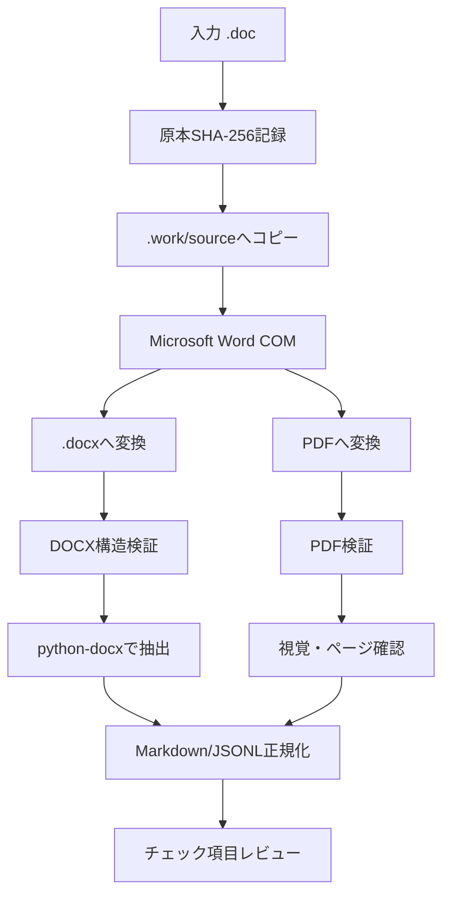

# CodexSkills-review

Codex の Skill Creator に渡す「設計書レビュースキル作成指示」を管理するリポジトリです。

このリポジトリ自体は完成済みのレビュースキルではありません。`SKILL_CREATOR_PROMPT.md` を Skill Creator に渡し、Windows 11 上で持ち運べる作業フォルダ一式を生成するために使用します。

旧 Word 形式 `.doc` を扱う場合は、追加指示 `DOC_LEGACY_WORD_SKILL_PROMPT.md` も併せて Skill Creator に渡してください。

## 目次

1. [ファイル構成](#1-ファイル構成)
2. [作成する仕組み](#2-作成する仕組み)
3. [前提環境](#3-前提環境)
4. [使い方](#4-使い方)
5. [DOC対応の追加方針](#5-doc対応の追加方針)
6. [生成後の想定構成](#6-生成後の想定構成)
7. [コンテキスト消費を抑える設計](#7-コンテキスト消費を抑える設計)
8. [安全性と品質の原則](#8-安全性と品質の原則)
9. [依存関係の方針](#9-依存関係の方針)
10. [初版の受入条件](#10-初版の受入条件)

## 1. ファイル構成

| ファイル | 役割 |
|---|---|
| `README.md` | 指示の目的、前提、使い方を人向けに説明します。 |
| `SKILL_CREATOR_PROMPT.md` | Skill Creator にそのまま渡す設計書レビューSkill全体の指示本文です。 |
| `DOC_LEGACY_WORD_SKILL_PROMPT.md` | `.doc` を Microsoft Word COM で `.docx` / PDF に正規化して扱う追加指示です。 |
| `.gitignore` | 入力設計書、レビュー結果、キャッシュ、仮想環境などの誤登録を防ぎます。 |

## 2. 作成する仕組み

Excel のチェック項目表を基準にして、次の形式の設計書をレビューする Codex のプロジェクト用Skillを作成します。

- Excel: `.xlsx`
- PowerPoint: `.pptx`
- Word: `.docx`
- 旧 Word: `.doc`（Microsoft Word による正規化が必要）
- PDF: `.pdf`

チェック観点の詳細資料も同じ形式を扱える構成を想定します。

レビューでは、チェック項目表の原本を直接編集せず、コピーへ結果を書き込みます。複数のレビュー対象を1回で処理する場合は、対象ファイルごとに `結果`、`コメント`、`レビュー対象ファイル名` の3列を追加します。

## 3. 前提環境

- OS: Windows 11
- Codex は配布された作業フォルダをルートとして起動します。
- 参照環境: Windows 11 x64 / CPython 3.11
- `.doc` を扱う場合は Microsoft Word デスクトップ版がローカルに必要です。
- `.docx/.xlsx/.pptx/.pdf` の通常処理は Microsoft Word を必須としません。
- LibreOffice は使用しません。
- 作業フォルダは他の利用者へそのまま渡せる構成にします。
- ドライブ名、Windows ユーザー名、特定端末の絶対パスは成果物へ保存しません。
- Codex の正式なプロジェクト指示ファイル名 `AGENTS.md` を使用します。

## 4. 使い方

1. Windows 11 上で空の作業フォルダを用意します。
2. そのフォルダを Codex のプロジェクトとして開きます。
3. Codex で `$skill-creator` を呼び出します。
4. `SKILL_CREATOR_PROMPT.md` の全文を渡します。
5. `.doc` もレビュー対象にする場合は、続けて `DOC_LEGACY_WORD_SKILL_PROMPT.md` の全文も渡します。
6. Skill Creator が必要なファイル、Python/PowerShellスクリプト、テスト、依存関係資料を実装するよう指示します。
7. 生成後、PowerShell でセットアップ、テスト、サンプルレビューを実行します。

## 5. DOC対応の追加方針

`.doc` はバイナリ形式を直接解析する前提にはしません。次の正規化フローを採用します。



役割は次の通りです。

- `.docx`: 見出し、段落、表、ヘッダー、フッター等の構造抽出
- PDF: ページ構成、図、配置等の視覚確認
- 原本 `.doc`: レビュー対象の正本として追跡し、変更しない

Microsoft Word が利用できない場合は `.doc` のみ安全停止し、LibreOffice 等へ自動フォールバックしません。

## 6. 生成後の想定構成

```text
<作業フォルダ>/
├─ AGENTS.md
├─ README.md
├─ .gitignore
├─ .agents/
│  └─ skills/
│     └─ review-design-documents/
│        ├─ SKILL.md
│        ├─ agents/
│        │  └─ openai.yaml
│        ├─ scripts/
│        │  ├─ preflight.py
│        │  ├─ normalize_legacy_word.py
│        │  ├─ validate_normalized_word.py
│        │  ├─ extract_documents.py
│        │  ├─ build_index.py
│        │  ├─ prepare_checklist.py
│        │  ├─ validate_results.py
│        │  ├─ write_results.py
│        │  └─ validate_output.py
│        └─ references/
├─ config/
├─ input/
│  ├─ checklists/
│  ├─ targets/
│  └─ references/
├─ output/
├─ .work/
│  ├─ source/
│  ├─ converted/
│  ├─ extracted/
│  ├─ index/
│  └─ cache/
├─ logs/
├─ tests/
├─ docs/
├─ requirements/
│  ├─ runtime.in
│  ├─ dev.in
│  ├─ tools.in
│  ├─ office.in
│  ├─ ocr.in
│  └─ locks/
├─ scripts/
│  ├─ compile-dependencies.ps1
│  ├─ audit-dependencies.ps1
│  └─ audit_licenses.py
├─ reports/
│  └─ dependencies/
├─ setup.ps1
└─ run-review.ps1
```

## 7. コンテキスト消費を抑える設計

- Office/PDFバイナリを毎回モデルへ丸ごと渡しません。
- Pythonで文書を位置情報付きJSONL等へ変換します。
- SHA-256と抽出・正規化処理版をキーにキャッシュします。
- チェック項目に関連するチャンクだけをCodexへ渡します。
- `.doc` は検証済み `.docx` / PDF がキャッシュされていれば Word COM を再実行しません。
- Codexは意味判断を担当し、Pythonはコピー、変換、抽出、索引、検証、Excel書込みを担当します。

## 8. 安全性と品質の原則

- 原本ファイルを直接更新しません。
- `.doc` は `.work/source/` の作業コピーだけを Word で開きます。
- Word COM では読み取り専用で開き、マクロを実行せず、外部リンクを自動更新しません。
- `.docx` と PDF の両方を変換後に検証し、失敗時はレビューへ進みません。
- 例外時も、このスキル自身が起動した Word Application を `Close` / `Quit` します。
- ユーザーが既に開いている Word セッションを終了しません。
- 原本 SHA-256 が変換前後で不変であることをテストします。
- 暗号化、破損、パスワード要求、抽出不能、未対応要素を黙って無視しません。
- ログへ設計書全文を出しません。

## 9. 依存関係の方針

既存の設計では `openpyxl`、`python-docx`、`python-pptx`、`pdfplumber`、`pypdf` 等を利用します。

`.doc` 対応では `pywin32` を Microsoft Word COM 呼び出しに使用します。`.doc` を対応形式として有効化する環境では、`pywin32` をその機能に必要な依存として固定・監査します。

Microsoft Word 自体はPythonライブラリではなく、利用者環境へ別途導入されたデスクトップアプリケーションです。スキルから配布・インストールしません。Microsoft Word の利用条件やライセンスは利用組織側の契約に従います。

Pythonの直接依存・推移依存は、無料利用、商用利用可否、ライセンス、再配布条件、既知脆弱性、Windows wheel を確認し、環境別ロックを作成します。

## 10. 初版の受入条件

- `.xlsx/.pptx/.docx/.pdf` を既存方式でレビューできること。
- Microsoft Word がある Windows 11 環境では `.doc` を `.docx` と PDF へ正規化してレビューできること。
- LibreOffice を使用しないこと。
- `.doc` 原本を一切変更しないこと。
- Word がない場合は `.doc` を安全停止し、他形式は処理できること。
- `.docx` と PDF の変換結果をそれぞれ検証すること。
- Word COM の例外時 cleanup をテストすること。
- `.doc` を含む Windows integration test と E2E を用意すること。
- 2回目の同一 `.doc` では検証済みキャッシュを利用し、不要な Word COM 再変換を避けること。
- manifest、ログ、設定へ端末固有の絶対パスを保存しないこと。
- 依存ライセンス・脆弱性監査とテスト結果を記録すること。
