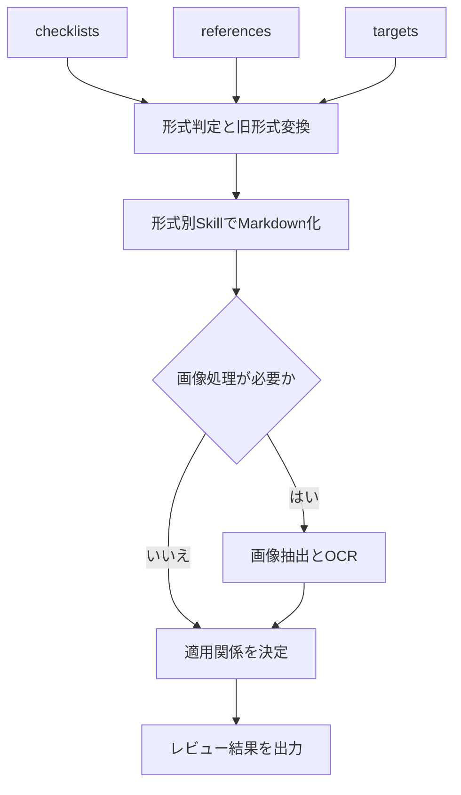

# CodexSkills-review — 設計書レビューリポジトリ

Windows 11 上の Codex で、Excel、Word、PowerPoint、PDF、画像を読み取り、Markdown へ変換し、必要に応じてファイルを編集できる、実装済みの設計書レビューリポジトリです。

設計書レビューでは、対象ファイルとチェックリストを先に Markdown へ変換し、生成された Markdown をレビュー対象にします。詳細なレビュー結果はチェックリストのコピーへ記入し、不適合項目と改善案を中心とするサマリーを Markdown で作成します。編集を依頼された場合は、形式ごとの Python ライブラリを使って編集済み対象ファイルを出力します。

このリポジトリには、利用者向けの `README.md`、Codex の共通指示を記載する `AGENTS.md`、`.agents/skills/` 配下の8つのプロジェクト固有 Skill、入力用フォルダ、作業用フォルダ、出力用フォルダを配置しています。`README.md` は利用手順であると同時に、Skill Creator で Skill を保守・再生成するときの正本です。

入力ファイル、作業中間物、編集済みファイル、レビュー結果は利用者の端末上で扱い、Git へは通常コミットしません。リポジトリをコピーまたはクローンした利用者が、決められたフォルダへファイルを置くだけでレビューを開始できる構成にします。

## 目次

1. [目的](#1-目的)
2. [基本方針](#2-基本方針)
3. [対応形式](#3-対応形式)
4. [実装済み Skill](#4-実装済み-skill)
5. [使用するライブラリ](#5-使用するライブラリ)
6. [Windows 11 へのインストール](#6-windows-11-へのインストール)
7. [作業フォルダ構成](#7-作業フォルダ構成)
8. [ファイル読み取りと Markdown 変換](#8-ファイル読み取りと-markdown-変換)
9. [ファイル編集](#9-ファイル編集)
10. [YAML フロントマター](#10-yaml-フロントマター)
11. [設計書レビュー](#11-設計書レビュー)
12. [旧 Office 形式の扱い](#12-旧-office-形式の扱い)
13. [形式別の要件](#13-形式別の要件)
14. [テストと完了条件](#14-テストと完了条件)
15. [Skill Creator による保守](#15-skill-creator-による保守)

## 1. 目的

次の作業を Codex から一貫して実行できるようにします。

1. Excel、Word、PowerPoint、PDF、画像の内容を読み取る。
2. 各ファイルをレビューしやすい Markdown へ変換する。
3. 画像とスキャン PDF に含まれる日本語・英語の文字を OCR で抽出する。
4. Excel 形式のチェックリストと、必要に応じて与えられる参考資料を読み取る。
5. 生成した Markdown を使って設計書をレビューする。
6. 不適合項目と改善案を中心とするレビューサマリーを Markdown で作成する。
7. ユーザーの指示に基づき、元の形式を保った編集済みファイルを作成する。
8. 旧 Office 形式は、Microsoft Office を使って新形式へ変換してから処理する。

### 1.1 利用者向けクイックスタート

初回は、§6に従って Python 3.12 以上、使用する形式のライブラリ、OCR を使う場合の Tesseract をインストールします。Skill と `AGENTS.md` はリポジトリに含まれているため、作成作業は不要です。

レビューは次の順で利用します。

1. レビューのチェックリストを `input/checklists/` へ置く。
2. チェックリストから参照する基準書、規約、参考資料を `input/references/` へ置く。
3. レビュー対象の設計書や画像を `input/targets/` へ置く。
4. リポジトリルートで Codex を開き、次のように依頼する。

```text
input/checklists、input/references、input/targetsを使ってレビューを実行し、結果をoutput/reviewsへ保存してください。
```

5. レビュー実行時刻を表す `output/reviews/yyyyMMddhhmm/` 内で、結果記入済みのチェックリストと `summary.md` を確認する。
6. 元ファイルへの反映も依頼した場合は、編集済みファイルを `output/edited/` で確認する。

Codex は最初に `$review-documents-orchestrator` を読み、環境確認、Markdown 変換、AI レビュー、結果チェックリスト、`summary.md` の作成まで進めます。環境確認と変換だけをコマンドで実行したい場合は、次を使用できます。

```powershell
py -3 review.py preflight
py -3 review.py prepare
```

`prepare` は AI の判定を行わず、`work/` に Markdown とレビューバンドルを準備します。通常は上記の自然言語依頼を使い、Skill に一連の処理を任せてください。

## 2. 基本方針

1. Windows 11 上の Codex で動作させる。
2. 作業フォルダを他の利用者へ渡せるよう、設定と成果物のパスは相対パスにする。
3. `.xlsx`、`.docx`、`.pptx`、`.pdf`、画像ごとに独立した Skill を作る。
4. 各形式の Skill は、読み取り、Markdown 変換、編集の3つを担当する。
5. 文書の役割は、`input/checklists/`、`input/references/`、`input/targets/` の配置場所で明確にする。
6. レビューの前に、3つの入力フォルダにある対応ファイルをすべて Markdown へ変換する。
7. AI は生成済み Markdown を使って、チェック項目、参照資料、レビュー対象の適用関係を判断する。
8. Office/PDF 内の画像も抽出し、OCR を実行する。
9. レビュー結果はチェックリストのコピーへ記入し、不適合項目と改善案を中心とする `summary.md` とともに `output/reviews/yyyyMMddhhmm/` へ保存する。
10. 通常の処理では `input/` に置いたファイルを上書きしない。
11. ライブラリは、無償で利用でき、商用利用可能なものを使用する。
12. LibreOffice は使用しない。

## 3. 対応形式

| 入力形式 | 読み取り | Markdown 変換 | 編集 | 処理方法 |
|---|---:|---:|---:|---|
| `.xlsx` | 対応 | 対応 | 対応 | `openpyxl` |
| `.docx` | 対応 | 対応 | 対応 | `python-docx` |
| `.pptx` | 対応 | 対応 | 対応 | `python-pptx` |
| `.pdf` | 対応 | 対応 | 一部対応 | `pypdf`、`pdfplumber` |
| `.png/.jpg/.jpeg` | 対応 | 対応 | 対応 | `Pillow`、`pytesseract`、Tesseract OCR |
| `.tif/.tiff` | 対応 | 対応 | 対応 | `Pillow`、`pytesseract`、Tesseract OCR |
| `.bmp/.webp` | 対応 | 対応 | 対応 | `Pillow`、`pytesseract`、Tesseract OCR |
| `.xls` | 対応 | 対応 | 対応 | Microsoft Excel で `.xlsx` へ変換後に処理 |
| `.doc` | 対応 | 対応 | 対応 | Microsoft Word で `.docx` へ変換後に処理 |
| `.ppt` | 対応 | 対応 | 対応 | Microsoft PowerPoint で `.pptx` へ変換後に処理 |

初版では、マクロ付き形式、パスワード付きファイル、破損ファイル、SVG、動画、手書き文字専用 OCR は対象外とします。

画像と画像だけで構成された PDF は OCR の対象です。OCR で読み取れない文字や、図形、矢印、線、色だけで表現された意味は推測せず、Markdown に `要確認` として記録します。

PDF は Office ファイルのように任意の文章やレイアウトを自由に書き換えられる形式ではありません。初版の PDF 編集は、ページの削除・並べ替え・回転、別 PDF の結合、メタデータ変更を対象とします。本文そのものを修正する場合は、可能であれば変換元の Word、Excel、PowerPoint を編集して PDF を再作成します。

## 4. 実装済み Skill

| Skill 名 | 主な役割 | 入力 | 出力 |
|---|---|---|---|
| `xlsx-document` | XLSX の読み取り、Markdown 変換、編集 | `.xlsx` | `.md` または編集済み `.xlsx` |
| `docx-document` | DOCX の読み取り、Markdown 変換、編集 | `.docx` | `.md` または編集済み `.docx` |
| `pptx-document` | PPTX の読み取り、Markdown 変換、編集 | `.pptx` | `.md` または編集済み `.pptx` |
| `pdf-document` | PDF の読み取り、Markdown 変換、対応可能な編集 | `.pdf` | `.md` または編集済み `.pdf` |
| `image-document` | 画像の読み取り、OCR、Markdown 変換、編集 | 対応画像形式 | `.md` または編集済み画像 |
| `convert-legacy-office` | 旧 Office 形式を新形式へ変換 | `.xls/.doc/.ppt` | `.xlsx/.docx/.pptx` |
| `review-markdown-documents` | Markdown 化されたチェックリスト、参考資料、対象をレビュー | 役割別の `.md` 一式 | チェック項目と対象ファイルごとの判定・根拠データ |
| `review-documents-orchestrator` | 変換、対応付け、レビュー、チェックリストへの結果記入、サマリー作成を順番に実行 | `input/checklists/`、`input/references/`、`input/targets/` | `work/` の中間物、結果チェックリスト、`summary.md` |

形式ごとの読み取り、変換、編集を1つの Skill にまとめます。読み取り用 Skill、OCR 用 Skill、編集用 Skill を別々に増やさず、画像処理は `image-document` にまとめます。

## 5. 使用するライブラリ

### 5.1 直接使用するライブラリ

| ライブラリ | 対象 | 読み取りで使う機能 | 編集で使う機能 | ライセンス | 料金 | 商用利用 | 注意事項 |
|---|---|---|---|---|---|---|---|
| `openpyxl` | XLSX | シート、セル、数式、スタイル、コメント、結合セルなど | セル値、数式、書式、シート、コメント、画像、グラフなど | MIT | 無料 | 可 | Excel の計算エンジンではないため、数式の再計算は行わない |
| `python-docx` | DOCX | 段落、見出し、表、スタイル、画像関係など | 文章、段落、表、スタイル、画像、セクションなど | MIT | 無料 | 可 | 変更履歴や一部の高度な Word 機能は直接扱えない |
| `python-pptx` | PPTX | スライド、図形、テキスト、表、画像、ノートなど | テキスト、図形、表、画像、配置、サイズ、スライドなど | MIT | 無料 | 可 | SmartArt、アニメーションなどは完全には編集できない |
| `pypdf` | PDF | ページ、テキスト、メタデータなど | ページ削除、並べ替え、回転、結合、メタデータ変更 | BSD-3-Clause | 無料 | 可 | 既存本文の自由な書き換えには向かない |
| `pdfplumber` | PDF | ページごとのテキスト、単語、表、座標など | 原則として読み取りに使用 | MIT | 無料 | 可 | スキャン PDF は `pdf-document` 内でページ画像化して OCR する |
| `reportlab` | PDF テスト | テスト用 PDF を生成する | テスト文書のページと文字を生成する | BSD | 無料 | 可 | 通常のレビュー実行では使用しない |
| `Pillow` | 画像 | PNG、JPEG、TIFF、BMP、WebP、画像情報、複数フレームなど | 切り抜き、回転、リサイズ、グレースケール、形式変換 | MIT-CMU | 無料 | 可 | SVG と動画は対象外 |
| `pytesseract` | 画像・スキャン PDF | Tesseract OCR を呼び出し、文字、位置、信頼度を取得 | 画像自体の編集には使用しない | Apache-2.0 | 無料 | 可 | OCR エンジン本体と日本語言語データを別途使用する |
| `pywin32` | 旧 Office | Microsoft Office の COM API を呼び出す | `.xls/.doc/.ppt` の変換と、必要な Office 操作 | 複数の許諾ライセンス | 無料 | 可 | Windows とインストール済み Microsoft Office が必要。同梱ライセンス文書に従う |

OCR エンジンには、Python ライブラリとは別に Tesseract OCR を使用します。Tesseract OCR と公式言語データは Apache-2.0 で、無償かつ商用利用可能です。初版では、通常の日本語 `jpn`、英語 `eng`、日本語縦書き `jpn_vert` を使用します。

### 5.2 主な依存関係

依存ライブラリは `pip` が自動的にインストールします。Skill のコードから直接利用しない依存ライブラリを、個別にインストールする手順は作りません。

| 親ライブラリ | 主な依存ライブラリ | 主な用途 |
|---|---|---|
| `openpyxl` | `et-xmlfile` | XLSX 内の XML 処理 |
| `python-docx` | `lxml`、`typing-extensions` | DOCX 内の XML 処理、型補助 |
| `python-pptx` | `lxml`、`Pillow`、`XlsxWriter`、`typing-extensions` | PPTX 内の XML、画像、グラフデータ処理 |
| `pdfplumber` | `pdfminer.six`、`Pillow`、`pypdfium2` | PDF テキスト解析、画像、ページ描画 |
| `reportlab` | `Pillow`、`charset-normalizer` | 画像と文字コード処理 |
| `Pillow` | 追加必須依存なし | 画像の読み取りと編集 |
| `pytesseract` | `Pillow`、`packaging` | OCR 入力画像とパッケージ情報の処理 |
| `pypdf` | 追加必須依存なし | PDF の基本操作 |
| `pywin32` | 追加必須依存なし | Windows API と COM 呼び出し |

依存関係はライブラリの更新によって変わる場合があります。レビュー開始前に、使用する Python 環境へインストール済みの一覧を次のコマンドで確認します。

```powershell
py -3 -m pip list
```

## 6. Windows 11 へのインストール

### 6.1 前提

- Windows 11 64bit
- CPython 3.12 以上の 64bit 版
- `py` コマンドが利用できること
- `.xls`、`.doc`、`.ppt` を扱う場合は Microsoft Office デスクトップ版がインストールされていること
- 画像とスキャン PDF の OCR を行う場合は Tesseract OCR がインストールされていること

PowerShell を開き、インストール済みの Python と、実際に使用される Python 3 を確認します。

```powershell
py --list
py -3 --version
py -3 -m pip --version
```

`py -3 --version` が `Python 3.12.0` 以上であることを確認します。3.11 以下が表示された場合は、Python 3.12 以上をインストールしてから続行します。以降の `py -3` は、Windows Python Launcher が選択する Python 3.12 以上の環境を表します。複数の Python 3 があり、使用するバージョンを明示したい場合は、たとえば `py -3.13` のように読み替えます。

`pip` を更新します。

```powershell
py -3 -m pip install --upgrade pip
```

### 6.2 ライブラリを1つずつグローバルインストールする

必要なライブラリをまとめてインストールする場合は、リポジトリルートで次を実行します。Windows では `pywin32` も対象になり、他の OS では環境マーカーにより除外されます。

```powershell
py -3 -m pip install -r requirements.txt
```

個別に確認しながらインストールする場合は、以下を順に実行します。

XLSX 用ライブラリをインストールします。

```powershell
py -3 -m pip install openpyxl
```

DOCX 用ライブラリをインストールします。

```powershell
py -3 -m pip install python-docx
```

PPTX 用ライブラリをインストールします。

```powershell
py -3 -m pip install python-pptx
```

PDF の基本操作用ライブラリをインストールします。

```powershell
py -3 -m pip install pypdf
```

PDF のテキスト・表読み取り用ライブラリをインストールします。

```powershell
py -3 -m pip install pdfplumber
```

PDF Skill のテスト用文書生成ライブラリをインストールします。通常のレビュー処理では使用しません。

```powershell
py -3 -m pip install reportlab
```

画像の読み取り・編集用ライブラリをインストールします。

```powershell
py -3 -m pip install Pillow
```

OCR 呼び出し用ライブラリをインストールします。

```powershell
py -3 -m pip install pytesseract
```

旧 Office 形式用ライブラリをインストールします。

```powershell
py -3 -m pip install pywin32
```

### 6.3 Tesseract OCR と日本語言語データ

`pytesseract` は Tesseract OCR を呼び出す Python ラッパーです。OCR エンジン本体は `pip` ではインストールされないため、[Tesseract 公式のインストール案内](https://tesseract-ocr.github.io/tessdoc/Installation.html)に従って Windows 11 へインストールします。

インストール時またはインストール後に、次の公式言語データを利用できるようにします。

| 言語データ | 用途 |
|---|---|
| `jpn` | 横書きを中心とする日本語 |
| `eng` | 英語 |
| `jpn_vert` | 日本語縦書き |

言語データが同梱されていない場合は、Tesseract 公式の [`tessdata_fast`](https://github.com/tesseract-ocr/tessdata_fast) から対応する `.traineddata` を取得し、Tesseract の `tessdata` フォルダへ配置します。

PowerShell を新しく開き、Tesseract 本体と言語データを確認します。

```powershell
tesseract --version
tesseract --list-langs
```

一覧に `jpn`、`eng`、`jpn_vert` が表示されれば OCR の準備は完了です。Skill は PATH 上の `tesseract` コマンドを使用し、端末固有のインストール先をスクリプトへ直接記述しません。

### 6.4 インストール確認

初回セットアップ後と各レビューの開始前に、使用する Python、ライブラリ、ツールが利用可能か確認します。まず、Python が3.12以上であることを機械的に確認します。

```powershell
py -3 -c "import sys; assert sys.version_info >= (3, 12), 'Python 3.12以上が必要です'; print(sys.version)"
```

次に、必要な Python ライブラリを import できることを確認します。

```powershell
py -3 -c "import openpyxl; print('openpyxl: OK')"
py -3 -c "import docx; print('python-docx: OK')"
py -3 -c "import pptx; print('python-pptx: OK')"
py -3 -c "import pypdf; print('pypdf: OK')"
py -3 -c "import pdfplumber; print('pdfplumber: OK')"
py -3 -c "import reportlab; print('reportlab: OK')"
py -3 -c "from PIL import Image; print('Pillow: OK')"
py -3 -c "import pytesseract; print('pytesseract: OK')"
```

OCR を使用する場合は、Python ライブラリだけでなく、Tesseract 本体と言語データも確認します。

```powershell
tesseract --version
tesseract --list-langs
```

`.xls`、`.doc`、`.ppt` を処理する場合は、`pywin32` に加えて Microsoft Office の COM 登録も確認します。

```powershell
py -3 -c "import win32com.client; print('pywin32: OK')"
Test-Path Registry::HKEY_CLASSES_ROOT\Excel.Application
Test-Path Registry::HKEY_CLASSES_ROOT\Word.Application
Test-Path Registry::HKEY_CLASSES_ROOT\PowerPoint.Application
```

3つとも `True` なら、Excel、Word、PowerPoint の COM 登録を確認できています。入力形式に必要な確認がすべて成功した場合だけ処理を開始します。不足しているライブラリやツールがある場合は処理を開始せず、不足項目、必要となる入力形式、README 内のインストール手順を利用者へ案内します。

## 7. 作業フォルダ構成

```text
<設計書レビューリポジトリ>/
├─ README.md
├─ AGENTS.md
├─ .gitignore
├─ requirements.txt
├─ review.py
├─ test_all.py
├─ tests/
│  └─ test_repository_structure.py
├─ .agents/
│  └─ skills/
│     ├─ README.md
│     ├─ xlsx-document/
│     ├─ docx-document/
│     ├─ pptx-document/
│     ├─ pdf-document/
│     ├─ image-document/
│     ├─ convert-legacy-office/
│     ├─ review-markdown-documents/
│     └─ review-documents-orchestrator/
├─ input/
│  ├─ checklists/
│  │  └─ README.md
│  ├─ references/
│  │  └─ README.md
│  └─ targets/
│     └─ README.md
├─ work/
│  ├─ README.md
│  ├─ converted-office/
│  │  └─ yyyyMMddhhmm/
│  ├─ images/
│  │  └─ yyyyMMddhhmm/
│  ├─ markdown/
│  │  └─ yyyyMMddhhmm/
│  └─ review-runs/
│     └─ yyyyMMddhhmm/
└─ output/
   ├─ edited/
   │  └─ README.md
   └─ reviews/
      ├─ README.md
      └─ yyyyMMddhhmm/
         ├─ summary.md
         └─ <チェックリスト名>.xlsx
```

各 Skill フォルダは、次の基本構成にします。Skill フォルダ内には補助的な `README.md` を置かず、Codex が必要とするファイルだけを配置します。

```text
.agents/skills/<skill-name>/
├─ SKILL.md
├─ agents/
│  └─ openai.yaml
├─ scripts/
├─ references/   # 詳細資料が必要なSkillだけ
├─ assets/       # テンプレート等が必要なSkillだけ
└─ tests/
```

Codex は、リポジトリ内の共通 Skill をリポジトリルートの `.agents/skills/` から読み込みます。各 Skill 内部の `agents/openai.yaml` は、その Skill の表示情報や依存関係を記述する任意のメタデータであり、リポジトリ側の `.agents/skills/` とは役割が異なります。配置規則は [Codex 公式「Build skills」](https://developers.openai.com/codex/build-skills) に従います。

### 7.1 フォルダの役割

| フォルダ | 利用者が行うこと | 内容 |
|---|---|---|
| `.agents/skills/` | 通常は変更しない | Codex がリポジトリ共通で読み込む、Skill Creator 作成・検証済みの全 Skill を格納する |
| `input/checklists/` | チェックリストを置く | 1行目を見出し、2行目以降を項目とする XLSX のレビュー項目表。複数配置可能 |
| `input/references/` | 必要な参考資料を置く | チェックリストが参照する規約、基準書、用語集、参考設計等 |
| `input/targets/` | レビュー対象を置く | XLSX、DOCX、PPTX、PDF、旧 Office 形式、対応画像形式 |
| `work/` | 通常は操作しない | 新形式化した Office、抽出画像、変換済み Markdown 等の中間物 |
| `output/reviews/` | 結果を確認する | 実行時刻別フォルダ内の、結果を記入したチェックリストのコピーと Markdown サマリー |
| `output/edited/` | 対象ファイルの編集も依頼した場合に確認する | 編集済みのレビュー対象ファイル |

各パスはリポジトリのルートを基準にした相対パスとして扱います。利用者ごとのユーザー名、ドライブ名、絶対パスを設定へ埋め込みません。入力フォルダでは、案件やシステム単位のサブフォルダを作成して構いません。リポジトリ外のファイルを誤って読み書きしないよう、構成フォルダ、入力、出力パス、出力先の祖先にあるシンボリックリンクやWindowsジャンクションは使用できません。

### 7.2 チェックリストから参考資料を参照する方法

チェックリストから参考資料を指定する場合は、リポジトリのルートを基準にした相対パスを記載します。

```text
input/references/security/security-guideline.pdf
```

ファイル名だけが記載されている場合は、`input/references/` 以下を再帰的に検索します。同名ファイルが複数ある場合や、指定された資料が見つからない場合は推測せず、レビュー結果を `要確認` として不足資料を記載します。

### 7.3 レビュー結果の配置

レビュー実行時のローカル時刻を `yyyyMMddhhmm` 形式にし、その名前のフォルダを作成します。Python では `%Y%m%d%H%M` を使用し、たとえば2026年8月17日19時30分の実行結果は `202608171930/` へ保存します。

```text
output/reviews/
└─ 202608171930/
   ├─ summary.md
   ├─ <チェックリスト1の元ファイル名>.xlsx
   └─ <チェックリスト2の元ファイル名>.xlsx   # 複数ある場合
```

各チェックリストを元のファイル名のまま実行時刻フォルダへコピーし、そのコピーへ結果を記入します。旧形式の `.xls` は変換後の `.xlsx` 名を使用します。同名または大文字・小文字だけが異なる名前が衝突する場合は、2件目以降へ `__2`、`__3` の連番を付けます。`input/checklists/` の原本は変更しません。コピーしたチェックリストの既存列の右側へ、レビュー対象ファイル1件につき次の3列を1組として追加します。

| 組内の順序 | 列名 | 記載内容 |
|---:|---|---|
| 1 | `レビュー対象ファイル名` | レビューしたファイル名 |
| 2 | `レビュー結果` | `適合`、`不適合`、`対象外`、`要確認` のいずれか |
| 3 | `レビューコメント` | AI が判定した根拠。該当箇所や使用した参考資料も含める |

レビュー対象が複数ある場合は、この3列を対象ファイル数分繰り返します。チェック項目の各行について、すべての対象ファイルの3列へ結果を記入します。

### 7.4 レビューサマリー

結果チェックリストと同じ実行時刻フォルダへ `summary.md` を作成します。サマリーは不適合項目を中心に、少なくとも次を記載します。

1. レビュー実施日時、使用したチェックリスト、参考資料、レビュー対象ファイル
2. `適合`、`不適合`、`対象外`、`要確認` の件数
3. `不適合` となったチェック項目、対象ファイル、判定根拠
4. 各不適合項目に対する AI の具体的な改善案
5. `要確認` となった項目と、判断に必要な不足情報

`不適合` が1件もない場合も `summary.md` を作成し、「不適合なし」と明記します。改善案はチェック項目、参考資料、レビュー対象の内容を根拠とし、ファイルを自動修正せず提案として記載します。

## 8. ファイル読み取りと Markdown 変換

処理順序は次のとおりです。



1. `input/checklists/`、`input/references/`、`input/targets/` にある対応ファイルをフォルダ別に列挙する。
2. チェックリストとレビュー対象が1件以上あることを確認する。参考資料は0件でもよい。
3. ファイルの役割は配置フォルダから決定し、AI に役割分類させない。
4. `.xls`、`.doc`、`.ppt` は、`work/converted-office/` の新形式へ変換する。
5. 形式ごとの Skill で、本文、表、見出し、シート名、スライド番号などを読み取る。
6. 単独画像と Office 内画像は `image-document` で OCR する。画像 PDF は `pdf-document` でページ画像化して OCR する。
7. 画像だけで構成された PDF はページを画像化し、日本語・英語の OCR を実行する。
8. OCR では文字列に加え、ページまたは画像内の位置と信頼度を取得する。
9. `work/markdown/` にファイルごとの Markdown を作成し、先頭に YAML フロントマターを付ける。
10. チェックリストに記載された相対パスやファイル名から、`input/references/` の参考資料を対応付ける。
11. チェックリストに対象指定がある場合はそれに従い、ない場合は内容から適用するレビュー対象を判断する。
12. 変換済み Markdown を使ってレビューし、チェックリストのコピーへ結果を記入する。
13. 不適合項目と改善案を中心とする `summary.md` を作成し、結果チェックリストとともに `output/reviews/yyyyMMddhhmm/` へ保存する。

## 9. ファイル編集

編集処理は、ユーザーの編集指示を形式別 Skill が受け取り、編集済みファイルを作成する流れにします。

1. 対象ファイルと編集内容を確認する。
2. 対象形式のライブラリでファイルを開く。
3. 指定された箇所だけを変更する。
4. `output/edited/` に別名で保存する。
5. 保存したファイルを同じライブラリでもう一度開く。
6. 指定した変更が反映されていることを確認する。
7. 変更したファイル、変更箇所、出力先を Markdown で報告する。

編集済みファイル名は、元の名前へ `_edited` を付けます。

```text
input/targets/basic-design.xlsx
output/edited/basic-design_edited.xlsx

input/targets/system-diagram.png
output/edited/system-diagram_edited.png
```

同名ファイルがすでにある場合は、日時を付けて別名にします。

```text
output/edited/basic-design_edited_20260817-120000.xlsx
```

## 10. YAML フロントマター

生成する Markdown の先頭には、変換元ファイルの情報を記載します。

```yaml
---
source_path: "input/targets/basic-design.xlsx"
source_name: "basic-design.xlsx"
source_format: "xlsx"
document_role: "target"
converted_at: "2026-08-17T12:00:00Z"
converter_skill: "xlsx-document"
---
```

旧 Office 形式を新形式へ変換した場合は、中間ファイルも記載します。

```yaml
---
source_path: "input/targets/basic-design.xls"
source_name: "basic-design.xls"
source_format: "xls"
document_role: "target"
intermediate_path: "work/converted-office/basic-design.xlsx"
intermediate_format: "xlsx"
converted_at: "2026-08-17T12:00:00Z"
converter_skill: "xlsx-document"
---
```

画像を変換した場合は、画像サイズと OCR の実行情報を記載します。

```yaml
---
source_path: "input/targets/system-diagram.png"
source_name: "system-diagram.png"
source_format: "png"
document_role: "target"
image_width_px: 1920
image_height_px: 1080
ocr_executed: true
ocr_languages:
  - "jpn"
  - "eng"
converted_at: "2026-08-17T12:00:00Z"
converter_skill: "image-document"
---
```

`document_role` は配置フォルダから `checklist`、`reference`、`target` のいずれかを設定します。YAML フロントマターには、レビュー時に元ファイルと役割を識別するために必要な項目だけを記録します。

## 11. 設計書レビュー

### 11.1 フォルダで決まる文書の役割

文書の役割は内容から自動分類せず、利用者が配置したフォルダで決定します。

| フォルダ | 役割 | 内容 |
|---|---|---|
| `input/checklists/` | `checklist` | チェック項目、確認観点、判定基準が記載された文書 |
| `input/references/` | `reference` | チェック観点や判定基準を補足する文書 |
| `input/targets/` | `target` | レビュー対象の設計書、仕様書、計画書、画像等 |

誤ったフォルダへ置かれた可能性が高いファイルを検出した場合も、自動で移動したり役割を変更したりせず、利用者へ確認します。

### 11.2 チェックリスト、参考資料、対象の対応付け

次の優先順位で適用関係を決定します。

1. チェックリストにリポジトリルート基準の相対パスが記載されている場合は、そのファイルを使用する。
2. ファイル名だけが記載されている場合は、対象フォルダ以下から同名ファイルを検索する。
3. 文書名や規約名だけが記載されている場合は、変換済み Markdown のタイトルと本文から候補を探す。
4. チェックリストにレビュー対象が明記されている場合は、その対象へ適用する。
5. 対象が明記されていない場合は、チェック項目の内容と対象文書の種類から適用先を判断する。

候補が複数ある、資料が見つからない、または適用先を確定できない場合は、推測で確定せず、該当項目を `要確認` として不足情報と候補を記載します。

### 11.3 レビュー結果

詳細なレビュー結果は、`input/checklists/` にあるチェックリストをコピーして作成します。レビュー実行時に `output/reviews/yyyyMMddhhmm/` を作り、コピーしたチェックリストの既存列の右側へ、対象ファイルごとの結果列を追加します。全体の要約は、同じフォルダの `summary.md` に分けて作成します。

対象ファイル1件につき、次の3列をこの順序で追加します。

1. `レビュー対象ファイル名`
2. `レビュー結果`
3. `レビューコメント`

対象ファイルが複数ある場合は3列1組を対象ファイル数分追加し、チェック項目の各行に対してすべての組へ結果を記入します。`レビュー対象ファイル名` にはその組で判定したファイル名を記載します。

`レビュー結果` は次の4種類だけを使用します。

| レビュー結果 | 使用条件 |
|---|---|
| `適合` | チェック項目を満たしていると根拠をもって判断できる |
| `不適合` | チェック項目を満たしていないと根拠をもって判断できる |
| `対象外` | そのチェック項目が対象ファイルへ適用されない |
| `要確認` | 資料不足、適用先不明、OCR不明瞭、視覚情報不足等により判断を確定できない |

`レビューコメント` には、AI がその結果を選んだ根拠を記載します。単なる結論だけにせず、Markdown の見出し、表、セル、スライド、ページ、画像番号、OCR位置、使用した参考資料等、利用者が確認できる該当箇所を含めます。結果が `適合`、`不適合`、`対象外`、`要確認` のいずれであってもコメントを記載します。

結果記入後は、出力したチェックリストを再度開き、元のチェック項目、追加した列、各行の結果が保持されていることを確認します。

OCR で得た文字列を根拠に使う場合は、画像番号またはページ番号、座標、信頼度を併記します。文字が欠けている、候補が競合している、信頼度が低い、または文字以外の視覚情報が判断に必要な場合は、断定せず `要確認` とします。

### 11.4 レビューサマリー

`summary.md` は、チェックリストへ記入した結果と一致させます。単なる全件の転記ではなく、特に `不適合` となった項目を中心に、問題の内容、判定根拠、具体的な改善案を読みやすくまとめます。

```markdown
# レビューサマリー

## レビュー概要

- 実施日時: <yyyyMMddhhmm>
- チェックリスト: <使用したファイル>
- 参考資料: <使用したファイル>
- レビュー対象: <レビューしたファイル>

## 判定集計

| 適合 | 不適合 | 対象外 | 要確認 |
|---:|---:|---:|---:|
| <件数> | <件数> | <件数> | <件数> |

## 不適合項目と改善案

### <チェック項目名>

- 対象ファイル: <ファイル名>
- チェックリスト位置: <シート名・行・セル等>
- 判定根拠: <不適合とした具体的な根拠>
- 改善案: <AIによる具体的で実行可能な提案>

## 要確認項目

- <項目、対象ファイル、不足情報>
```

不適合項目は、チェックリストの該当位置と対象ファイルを特定し、レビューコメントの根拠を簡潔に要約します。改善案は、チェックリストと参考資料の要求を満たすために何をどのように修正すべきかを具体化します。根拠が不足している場合は断定的な改善案を作らず、必要な確認事項を `要確認項目` に記載します。

## 12. 旧 Office 形式の扱い

`.xls`、`.doc`、`.ppt` は、Python ライブラリだけで直接処理しません。Windows 11 にインストールされた Microsoft Office を `pywin32` から操作し、作業用の新形式へ変換します。

| 旧形式 | 使用するアプリ | 変換先 |
|---|---|---|
| `.xls` | Microsoft Excel | `.xlsx` |
| `.doc` | Microsoft Word | `.docx` |
| `.ppt` | Microsoft PowerPoint | `.pptx` |

変換先は `work/converted-office/` とします。変換後は、新形式に対応する Skill で読み取り、Markdown 変換、編集を行います。

Microsoft Office がインストールされていない場合は、対象の旧形式を処理できないことを明確に表示します。LibreOffice への切り替えは行いません。

## 13. 形式別の要件

### 13.1 XLSX

読み取りでは、少なくとも次を Markdown に含めます。

- ブック名、シート名、シート順
- セル座標と値
- 数式
- 結合セル
- コメント
- 埋め込み画像の存在、アンカー、抽出先
- 抽出画像から取得した OCR 文字列、位置、信頼度

編集では、初版で次へ対応します。

- セル値と数式の変更
- シートの追加と名称変更
- チェックリストへのレビュー結果記入

### 13.2 DOCX

読み取りでは、少なくとも次を文書順に Markdown へ含めます。

- 見出し
- 段落
- 箇条書きと番号付きリスト
- 表
- ヘッダーとフッター
- ハイパーリンク
- 画像の存在、文書内の順序、抽出先
- 抽出画像から取得した OCR 文字列、位置、信頼度

編集では、初版で次へ対応します。

- 文書全体の文字列置換
- 段落の追加
- 既存表のセル編集

### 13.3 PPTX

読み取りでは、少なくとも次をスライド順に Markdown へ含めます。

- スライド番号とタイトル
- テキスト
- 図形名、種類、位置
- 表
- 画像図形と画像プレースホルダーの存在、スライド番号、図形名、抽出先
- 抽出画像から取得した OCR 文字列、位置、信頼度
- 発表者ノート

編集では、初版で次へ対応します。

- プレゼンテーション全体の文字列置換
- スライド番号と図形名を指定したテキスト変更

スライド背景として設定された画像は、初版の抽出対象外です。画像背景を検出した場合は、スライド番号と参照情報を Markdown に記録し、推測せず `要確認` として利用者へ確認します。単色など画像を使わない背景には、この記録を追加しません。

### 13.4 PDF

読み取りでは、少なくとも次をページ順に Markdown へ含めます。

- ページ番号
- 抽出できる本文
- 表
- メタデータ
- テキストと表の座標
- 画像領域
- 画像ページと埋込み画像から取得した OCR 文字列、位置、信頼度

編集では、初版で次へ対応します。

- ページの削除、並べ替え、回転
- 別 PDF の指定ページの結合
- メタデータの変更

本文を抽出できないページは画像として描画し、`pdf-document` 内から Tesseract OCR を実行します。OCR 後も文字を取得できない場合は、そのページを読み取れなかったことを Markdown へ記載します。

### 13.5 画像

`image-document` は、単独の画像、Office から抽出した画像、PDF から抽出または描画した画像を同じ手順で処理します。

読み取りでは、少なくとも次を Markdown へ含めます。

- 元ファイルと、Office/PDF 内の画像の場合は元文書内の位置
- 画像形式
- 幅と高さ
- カラーモード
- 複数フレーム画像の場合はフレーム番号
- Markdown から確認できる画像への相対パス
- OCR で抽出した日本語・英語の文字列
- OCR 文字列ごとの座標と信頼度
- OCR で文字を取得できなかったこと

Markdown 本文は、次のように画像情報と OCR 結果を分けます。

```markdown
# 画像


## OCR 結果

| 文字列 | 左 | 上 | 幅 | 高さ | 信頼度 |
|---|---:|---:|---:|---:|---:|
| Webサーバー | 120 | 80 | 180 | 40 | 96.2 |
```

編集では、初版で次へ対応します。

- 切り抜き
- 回転
- リサイズ
- グレースケール化
- PNG、JPEG、TIFF、BMP、WebP 間の形式変換

OCR は画像内の文字を抽出する機能です。図形間の接続、矢印の方向、色の意味、写真の内容など、文字以外の視覚的な意味を完全には Markdown 化しません。その情報がレビュー項目に関係する場合は `要確認` とします。

## 14. テストと完了条件

形式別の処理をテストする前に、実行環境について次を確認します。

1. Python 3.12 以上では実行でき、Python 3.11 以下では処理開始前に明確なエラーを表示する。
2. 入力形式に必要な Python ライブラリがすべて import できる。
3. OCR が必要な場合は、Tesseract 本体と `jpn`、`eng`、`jpn_vert` を検出できる。
4. 旧 Office 形式がある場合は、`pywin32` と必要な Microsoft Office の COM 登録を検出できる。
5. 必要なライブラリまたはツールが不足している場合は処理を開始せず、不足項目を利用者へ案内する。

### 14.1 形式別テスト

各 Skill に、次の最小テストを作成します。

1. サンプルファイルを読み取れる。
2. Markdown を作成できる。
3. YAML フロントマターに元ファイル情報が入る。
4. 代表的な1項目を編集できる。
5. 編集済みファイルを再度開ける。
6. 指定した変更が編集済みファイルに反映されている。
7. `input/` のファイルが通常処理で上書きされていない。

### 14.2 画像と OCR のテスト

Windows 11、Tesseract OCR、`jpn`、`eng`、`jpn_vert` を使って、次を確認します。

1. PNG、JPEG、TIFF、BMP、WebP を読み取れる。
2. 画像サイズ、形式、カラーモードを Markdown へ記録できる。
3. 横書きの日本語と英語を OCR できる。
4. 日本語縦書きを OCR できる。
5. OCR 文字列の座標と信頼度を記録できる。
6. 文字のない画像でも失敗せず、OCR 結果なしと記録できる。
7. 画像を編集し、編集済み画像を再度開ける。
8. Office 内の画像を抽出し、元文書内の位置と対応付けられる。
9. 画像だけで構成された PDF の各ページを OCR できる。

### 14.3 旧形式テスト

Windows 11 と Microsoft Office デスクトップ版を使って、次を確認します。

1. `.xls` を `.xlsx` へ変換できる。
2. `.doc` を `.docx` へ変換できる。
3. `.ppt` を `.pptx` へ変換できる。
4. 変換後の新形式を対応 Skill で読み取れる。
5. 変換後の新形式を編集できる。

### 14.4 レビューの一連テスト

1. `input/checklists/` にチェックリストを置く。
2. `input/references/` にチェックリストが参照する資料を置く。
3. `input/targets/` に設計書と画像を置く。
4. 配置フォルダに従って役割を決定し、すべての対応ファイルを Markdown へ変換する。
5. 単独画像、Office 内の画像、画像 PDF へ OCR を実行する。
6. OCR 結果を元ファイル、ページ、スライド、シート、画像番号と対応付ける。
7. チェックリストから参考資料とレビュー対象を対応付ける。
8. Markdown を使って設計書をレビューする。
9. `output/reviews/yyyyMMddhhmm/` を作成し、チェックリストを元のファイル名でコピーする。
10. コピーしたチェックリストへ、対象ファイル1件につき `レビュー対象ファイル名`、`レビュー結果`、`レビューコメント` の3列を追加する。
11. チェック項目の各行と各対象ファイルの組み合わせに、`適合`、`不適合`、`対象外`、`要確認` のいずれかと根拠コメントを記入する。
12. 出力したチェックリストを再度開き、原本が未変更で、追加列と記入結果が保持されていることを確認する。
13. `summary.md` を作成し、判定件数とすべての不適合項目をチェックリストと一致させる。
14. 各不適合項目について、対象ファイル、判定根拠、具体的な改善案が記載されていることを確認する。

### 14.5 リポジトリ構成の受入条件

1. ルートに `README.md`、`AGENTS.md`、`.gitignore` がある。
2. `.agents/skills/` に8つの Skill フォルダがある。
3. 各 Skill に `SKILL.md` と `agents/openai.yaml` がある。
4. 各 Skill の名前と `SKILL.md` の `name` が一致する。
5. `input/checklists/`、`input/references/`、`input/targets/` がある。
6. `work/converted-office/`、`work/images/`、`work/markdown/` を実行時に作成できる。
7. `output/reviews/` と `output/edited/` がある。
8. 入力、作業中間物、出力成果物が通常の Git 管理対象から除外される。
9. レビュー実行時に `output/reviews/yyyyMMddhhmm/`、結果記入済みチェックリスト、`summary.md` を作成できる。
10. Python 3.12 以上と、入力形式に必要なライブラリ・ツールを処理前に検証できる。

初版の完了条件は、`AGENTS.md`、5つの形式別 Skill、旧形式変換 Skill、レビュー Skill、orchestrator Skill、入力・作業・出力フォルダが揃い、Office、PDF、画像の読み取り、OCR、Markdown 変換、編集、レビューの一連の処理を実行できることです。

## 15. Skill Creator による保守

8つの Skill と `AGENTS.md` は Skill Creator を使用して実装済みです。機能追加や再生成を行う場合は、この README 全体を正本として、リポジトリのルートで次の順に作業します。

1. §7のフォルダ構成を作成する。
2. ルートに §15.1 の要件を満たす `AGENTS.md` を作成する。
3. `.agents/skills/` に8つの Skill を作成する。
4. 各 Skill の `agents/openai.yaml` を生成する。
5. 各 Skill のスクリプトとテストを実装する。
6. 各 Skill を個別に検証する。
7. `review-documents-orchestrator` で一連テストを実行する。
8. §14.5のリポジトリ構成を確認する。

### 15.1 AGENTS.md の保守要件

`AGENTS.md` は [Codex 公式「Custom instructions with AGENTS.md」](https://developers.openai.com/codex/agent-configuration/agents-md) の階層規則に従い、少なくとも次の内容を保ちます。実装した Skill 名やスクリプト名に合わせた調整は許可しますが、入力フォルダの役割と必須処理順序は変更しません。

```markdown
# AGENTS.md

## 目的

この作業フォルダでは、チェックリストと参考資料を使って設計書をレビューし、必要に応じて元形式の編集済みファイルを作成する。

## 使用言語

- 利用者への説明、確認、レビュー結果は日本語で記載する。
- ファイル名、セル位置、コード、固有名詞は原文を保持する。

## 実行前の環境確認

- 使用するPythonが3.12以上であることを確認し、3.12へ固定しない。
- 入力ファイルの形式を確認し、その処理に必要なPythonライブラリをimportできることを確認する。
- OCRを使用する場合は、PATH上のTesseract本体と`jpn`、`eng`、`jpn_vert`の言語データを確認する。
- `.xls`、`.doc`、`.ppt`を処理する場合は、`pywin32`とMicrosoft Excel、Word、PowerPointのCOM登録を確認する。
- 必要なライブラリやツールが不足している場合は処理を開始せず、不足項目とREADMEのインストール手順を利用者へ案内する。

## フォルダの役割

- `.agents/skills/`: このリポジトリで使用するプロジェクト固有のSkill
- `input/checklists/`: レビューのチェックリスト
- `input/references/`: チェックリストから参照する基準書と参考資料
- `input/targets/`: レビュー対象の設計書と画像
- `work/`: 変換済みOffice、抽出画像、Markdown等の中間物
- `output/reviews/`: 実行時刻別フォルダ、結果記入済みチェックリスト、Markdownサマリー
- `output/edited/`: 利用者が編集を依頼したレビュー対象ファイル

## 必須の処理順序

1. Python、必要なライブラリ、入力形式に必要なツールの利用可否を確認する。
2. 3つの入力フォルダを確認する。
3. チェックリストとレビュー対象がない場合は、必要なファイルを利用者へ案内する。
4. 旧Office形式を新形式へ変換する。
5. 形式別Skillで全入力をMarkdownへ変換する。
6. 画像と画像PDFへOCRを実行する。
7. チェックリストから参考資料とレビュー対象を対応付ける。
8. Markdownを使ってレビューする。
9. `output/reviews/yyyyMMddhhmm/`を作り、チェックリストのコピーへ結果を記入する。
10. 不適合項目と改善案を中心とする`summary.md`を作成して同じフォルダへ保存する。
11. 対象ファイルの編集を依頼された場合だけ、編集済みファイルを`output/edited/`へ保存する。

## Skillの使用

- プロジェクト固有のSkillは`.agents/skills/`から使用する。
- 一連のレビューでは、最初に`review-documents-orchestrator`を使用する。
- 個別形式の処理では、対象形式のSkillを使用する。
- Skillを使用する前に、その`SKILL.md`を最後まで読む。
- Skill内の既存スクリプトを優先し、同じ処理を毎回書き直さない。
- 利用者向け入口として`review.py`を使用し、個別スクリプトの引数を利用者へ要求しない。

## 実装変更時の検証

- Skillを変更した場合はSkill Creatorの`quick_validate.py`で対象Skillを検証する。
- Pythonスクリプトを変更した場合は、リポジトリルートで`py -3 test_all.py`を実行する。
- テスト用ファイルは一時フォルダへ作成し、`input/`の利用者ファイルをテストに使用しない。

## レビュー規則

- 文書の役割は配置フォルダで決定する。
- `input/checklists/`の原本を上書きせず、実行時刻フォルダへコピーする。
- コピーしたチェックリストへ、対象ファイル1件につき`レビュー対象ファイル名`、`レビュー結果`、`レビューコメント`の3列を追加する。
- チェック項目の各行と各対象ファイルの組み合わせに結果を記載する。
- レビュー結果は`適合`、`不適合`、`対象外`、`要確認`だけを使用する。
- レビューコメントには、AIが判定した根拠と確認可能な該当箇所を記載する。
- 参考資料不足、適用先不明、OCR不明瞭、視覚情報不足は推測せず`要確認`とする。
- 入力ファイルを通常処理で上書きしない。
- パスはリポジトリルート基準の相対パスで扱う。
- LibreOfficeやREADMEに記載のない外部変換サービスを使用しない。

## レビューサマリー

- `summary.md`は結果記入済みチェックリストと同じ`output/reviews/yyyyMMddhhmm/`へ保存する。
- 使用したチェックリスト、参考資料、対象ファイルと、4種類の判定件数を記載する。
- 特にすべての`不適合`項目を中心に、チェック項目、対象ファイル、チェックリスト位置、判定根拠をまとめる。
- 不適合項目ごとに、チェックリストと参考資料を根拠とした具体的で実行可能な改善案を記載する。
- 不適合がない場合もサマリーを作成し、「不適合なし」と明記する。
- 根拠が不足している内容は断定的な改善案にせず、必要な情報を`要確認`として記載する。
```

### 15.2 Skill の保守順序

1. `xlsx-document`
2. `docx-document`
3. `pptx-document`
4. `pdf-document`
5. `image-document`
6. `convert-legacy-office`
7. `review-markdown-documents`
8. `review-documents-orchestrator`

Skill を新規作成または再生成するときは、Skill Creator の `init_skill.py` を使って `.agents/skills/` の直下へ初期化します。初期化後は、Skill の内容に合わせて必要なリソースだけを残します。

```text
.agents/skills/<skill-name>/
├─ SKILL.md
├─ agents/
│  └─ openai.yaml
├─ scripts/
├─ references/   # 必要な場合だけ
├─ assets/       # 必要な場合だけ
└─ tests/
```

Skill フォルダ内に `README.md`、インストールガイド、変更履歴等の補助文書を追加しません。利用者向け説明はルートの `README.md` に集約し、Skill の詳細手順は `SKILL.md`、必要時だけ読む詳細情報は `references/` に分けます。

### 15.3 Skill 実装の共通指示

1. Skill 名には小文字、数字、ハイフンだけを使用する。
2. `SKILL.md` の YAML フロントマターには `name` と `description` だけを記載する。
3. `description` には、Skill の機能と起動すべきファイル形式・依頼内容を明記する。
4. `SKILL.md` 本文は命令形で簡潔に記載する。
5. Python 3.12 以上で動作させ、Python 3.12 のみに固定しない。
6. orchestrator は入力形式を確認し、処理開始前に必要な Python ライブラリと外部ツールの利用可否を検証する。
7. 不足しているライブラリやツールがある場合は処理を開始せず、不足項目とインストール手順を利用者へ案内する。
8. 読み取り、Markdown 変換、編集は再実行可能な Python スクリプトとして作る。
9. スクリプトの引数にはリポジトリルート基準の相対パスを使用する。
10. 生成先は `work/` または `output/` とする。
11. Markdown には元ファイル情報の YAML フロントマターを付ける。
12. 編集後は、出力ファイルを再度開いて変更内容を確認する。
13. 画像 OCR では、文字列だけでなく座標と信頼度も Markdown に記録する。
14. Office/PDF から抽出した画像は、元文書内の位置を保持する。
15. チェックリスト原本を実行時刻フォルダへコピーし、対象ファイルごとの3列へ結果を記入する。
16. レビュー結果には `適合`、`不適合`、`対象外`、`要確認` だけを使用する。
17. `summary.md` を作成し、判定件数と、不適合項目ごとの対象ファイル、根拠、具体的な改善案を記載する。
18. 形式別テストと一連テストを作る。
19. 各 Skill を Skill Creator の `quick_validate.py` で検証する。
20. `agents/openai.yaml` は Skill Creator の生成スクリプトを使用し、`SKILL.md` と一致させる。
21. README に記載していない変換サービス、クラウドサービス、LibreOffice は追加しない。

### 15.4 完成時の確認

Skill Creator は、完了を報告する前に次を確認します。

1. `AGENTS.md` が作成され、§15.1の指示を含んでいる。
2. 8つの Skill が `.agents/skills/` に存在する。
3. 全 Skill が個別検証に合格している。
4. 入力・作業・出力フォルダが§7と一致する。
5. クイックスタートの依頼文で一連のレビューを開始できる。
6. レビュー結果が `output/reviews/yyyyMMddhhmm/` の結果記入済みチェックリストとして出力される。
7. 同じフォルダに、不適合項目と改善案を中心とする `summary.md` が出力される。
8. 対象ファイルの編集を依頼した場合だけ、編集済みファイルが `output/edited/` へ出力される。
9. Python 3.12 以上を受け入れ、必要なライブラリやツールの不足を処理開始前に検出できる。

実装を必要以上に複雑にせず、利用者が「フォルダへ置く」「レビューを依頼する」「結果を見る」の3段階で使えることを優先します。
