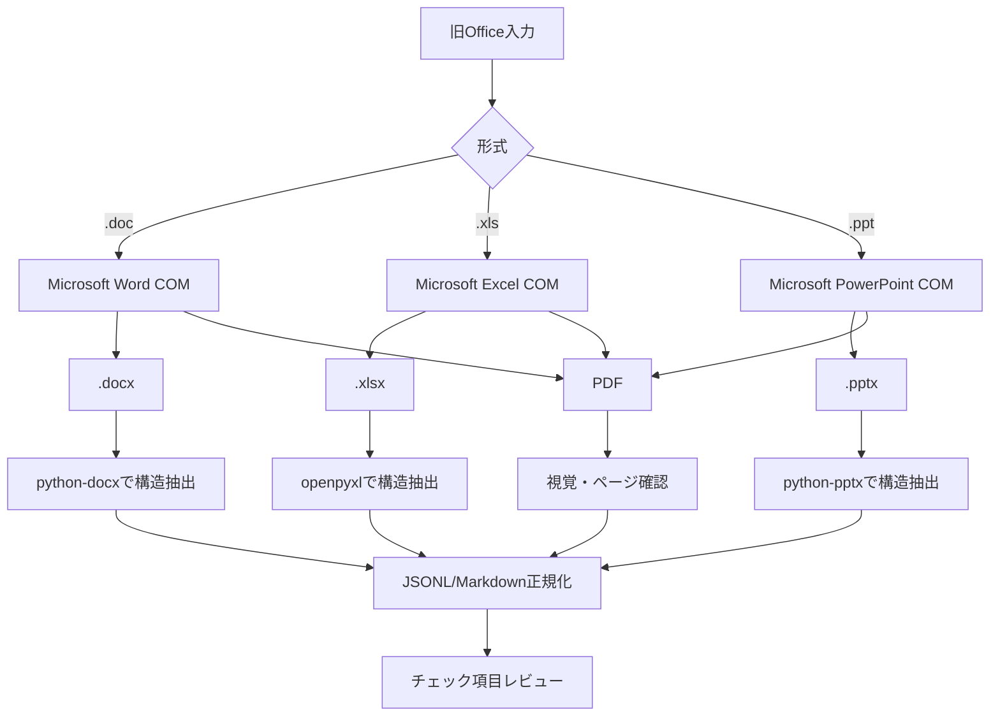

# CodexSkills-review

Codex の Skill Creator に渡す「設計書レビュースキル作成指示」を管理するリポジトリです。

このリポジトリ自体は完成済みのレビュースキルではありません。`SKILL_CREATOR_PROMPT.md` を Skill Creator に渡し、Windows 11 上で持ち運べる作業フォルダ一式を生成するために使用します。

旧 Microsoft Office 形式 `.doc`、`.xls`、`.ppt` も扱う場合は、追加指示 `LEGACY_OFFICE_SKILL_PROMPT.md` も併せて Skill Creator に渡してください。

## 目次

1. [ファイル構成](#1-ファイル構成)
2. [作成する仕組み](#2-作成する仕組み)
3. [前提環境](#3-前提環境)
4. [使い方](#4-使い方)
5. [旧Office形式対応の方針](#5-旧office形式対応の方針)
6. [生成後の想定構成](#6-生成後の想定構成)
7. [コンテキスト消費を抑える設計](#7-コンテキスト消費を抑える設計)
8. [安全性と品質の原則](#8-安全性と品質の原則)
9. [依存関係の方針](#9-依存関係の方針)
10. [初版の受入条件](#10-初版の受入条件)

## 1. ファイル構成

| ファイル | 役割 |
|---|---|
| `README.md` | 指示の目的、前提、使い方を人向けに説明します。 |
| `SKILL_CREATOR_PROMPT.md` | Skill Creator にそのまま渡す設計書レビュー Skill 全体の指示本文です。 |
| `LEGACY_OFFICE_SKILL_PROMPT.md` | `.doc/.xls/.ppt` を Microsoft Office COM で新形式＋PDFへ正規化して扱う追加指示です。 |
| `.gitignore` | 入力設計書、レビュー結果、キャッシュ、仮想環境などの誤登録を防ぎます。 |

## 2. 作成する仕組み

Excel のチェック項目表を基準にして、次の形式の設計書をレビューする Codex のプロジェクト用 Skill を作成します。

- Excel: `.xlsx`
- 旧 Excel: `.xls`
- PowerPoint: `.pptx`
- 旧 PowerPoint: `.ppt`
- Word: `.docx`
- 旧 Word: `.doc`
- PDF: `.pdf`

旧 Office 形式は直接解析せず、Microsoft Office デスクトップアプリケーションを使って新形式へ正規化した後に、既存の抽出処理へ渡します。

レビューでは、チェック項目表の原本を直接編集せず、コピーへ結果を書き込みます。複数のレビュー対象を1回で処理する場合は、対象ファイルごとに `結果`、`コメント`、`レビュー対象ファイル名` の3列を追加します。

## 3. 前提環境

- OS: Windows 11
- 参照環境: Windows 11 x64 / CPython 3.11
- Codex は配布された作業フォルダをルートとして起動します。
- `.doc` を扱う場合は Microsoft Word デスクトップ版が必要です。
- `.xls` を扱う場合は Microsoft Excel デスクトップ版が必要です。
- `.ppt` を扱う場合は Microsoft PowerPoint デスクトップ版が必要です。
- `.docx/.xlsx/.pptx/.pdf` の通常処理は Microsoft Office COM を必須としません。
- LibreOffice は使用しません。
- 作業フォルダは他の利用者へそのまま渡せる構成にします。
- ドライブ名、Windows ユーザー名、特定端末の絶対パスは成果物へ保存しません。
- Codex の正式なプロジェクト指示ファイル名 `AGENTS.md` を使用します。

## 4. 使い方

1. Windows 11 上で空の作業フォルダを用意します。
2. そのフォルダを Codex のプロジェクトとして開きます。
3. Codex で `$skill-creator` を呼び出します。
4. `SKILL_CREATOR_PROMPT.md` の全文を渡します。
5. 旧 Office 形式もレビュー対象にする場合は、続けて `LEGACY_OFFICE_SKILL_PROMPT.md` の全文を渡します。
6. Skill Creator が必要なファイル、Python/PowerShell スクリプト、テスト、依存関係資料を実装するよう指示します。
7. 生成後、PowerShell でセットアップ、テスト、サンプルレビューを実行します。

## 5. 旧Office形式対応の方針

旧形式は、構造化された新形式と PDF の2系統へ正規化します。



役割は次の通りです。

| 原本 | 構造解析用 | 視覚確認用 |
|---|---|---|
| `.doc` | `.docx` | PDF |
| `.xls` | `.xlsx` | PDF |
| `.ppt` | `.pptx` | PDF |

Microsoft Word、Excel、PowerPoint のうち必要なアプリが利用できない場合は、そのアプリに対応する旧形式だけを安全停止します。LibreOffice 等へ自動フォールバックしません。

## 6. 生成後の想定構成

```text
<作業フォルダ>/
├─ AGENTS.md
├─ README.md
├─ .gitignore
├─ .agents/
│  └─ skills/
│     └─ review-design-documents/
│        ├─ SKILL.md
│        ├─ agents/
│        │  └─ openai.yaml
│        ├─ scripts/
│        │  ├─ preflight.py
│        │  ├─ normalize_legacy_office.py
│        │  ├─ office_com.py
│        │  ├─ validate_normalized_office.py
│        │  ├─ extract_documents.py
│        │  ├─ build_index.py
│        │  ├─ prepare_checklist.py
│        │  ├─ validate_results.py
│        │  ├─ write_results.py
│        │  └─ validate_output.py
│        └─ references/
│           └─ legacy-office-normalization.md
├─ config/
├─ input/
│  ├─ checklists/
│  ├─ targets/
│  └─ references/
├─ output/
├─ .work/
│  ├─ source/
│  ├─ converted/
│  ├─ extracted/
│  ├─ index/
│  └─ cache/
├─ logs/
├─ tests/
├─ docs/
├─ requirements/
│  ├─ runtime.in
│  ├─ dev.in
│  ├─ tools.in
│  ├─ office.in
│  ├─ ocr.in
│  └─ locks/
├─ scripts/
│  ├─ compile-dependencies.ps1
│  ├─ audit-dependencies.ps1
│  └─ audit_licenses.py
├─ reports/
│  └─ dependencies/
├─ setup.ps1
└─ run-review.ps1
```

## 7. コンテキスト消費を抑える設計

- Office/PDF バイナリを毎回モデルへ丸ごと渡しません。
- Python で文書を位置情報付き JSONL 等へ変換します。
- SHA-256 と抽出・正規化処理版をキーにキャッシュします。
- チェック項目に関連するチャンクだけを Codex へ渡します。
- 旧形式は検証済み正規化キャッシュがあれば Office COM の再実行を避けます。
- Codex は意味判断を担当し、Python はコピー、変換、抽出、索引、検証、Excel 書込みを担当します。

## 8. 安全性と品質の原則

- 原本ファイルを直接更新しません。
- 旧 Office 形式は `.work/source/` の作業コピーだけを Office で開きます。
- Word / Excel / PowerPoint COM では、マクロや外部リンクの自動実行を抑止します。
- 正規化した新形式と PDF の両方を検証し、失敗時はレビューへ進みません。
- 例外時も、このスキル自身が起動した Office Application を終了します。
- ユーザーが既に開いている Office セッションを終了しません。
- 原本 SHA-256 が変換前後で不変であることをテストします。
- 暗号化、破損、パスワード要求、Protected View、抽出不能、未対応要素を黙って無視しません。
- ログへ設計書全文を出しません。

## 9. 依存関係の方針

既存の設計では `openpyxl`、`python-docx`、`python-pptx`、`pdfplumber`、`pypdf` 等を利用します。

旧 Office 形式対応では `pywin32` を Microsoft Office COM 呼び出しに使用します。旧形式を有効化する環境では `pywin32` を固定・監査します。

Microsoft Word、Excel、PowerPoint 自体は Python ライブラリではなく、利用者環境へ別途導入されたデスクトップアプリケーションです。スキルから配布・インストールしません。利用条件・ライセンスは利用組織側の Microsoft Office 契約に従います。

Python の直接依存・推移依存は、無料利用、商用利用可否、ライセンス、再配布条件、既知脆弱性、Windows wheel を確認し、環境別ロックを作成します。

## 10. 初版の受入条件

- `.xlsx/.pptx/.docx/.pdf` を既存方式でレビューできること。
- `.doc -> .docx + PDF` を Microsoft Word COM で正規化できること。
- `.xls -> .xlsx + PDF` を Microsoft Excel COM で正規化できること。
- `.ppt -> .pptx + PDF` を Microsoft PowerPoint COM で正規化できること。
- LibreOffice を使用しないこと。
- 旧形式原本を一切変更しないこと。
- 必要な Office アプリがない場合、その旧形式だけ安全停止すること。
- 新形式と PDF の変換結果をそれぞれ検証すること。
- Office COM の例外時 cleanup と timeout をテストすること。
- `.doc/.xls/.ppt` を含む Windows integration test と E2E を用意すること。
- 2回目の同一入力では検証済みキャッシュを利用し、不要な Office COM 再変換を避けること。
- manifest、ログ、設定へ端末固有の絶対パスを保存しないこと。
- 依存ライセンス・脆弱性監査とテスト結果を記録すること。
