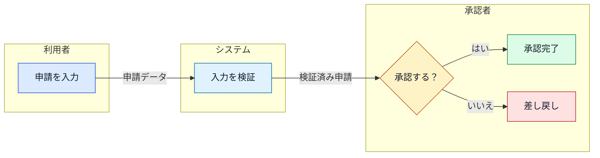
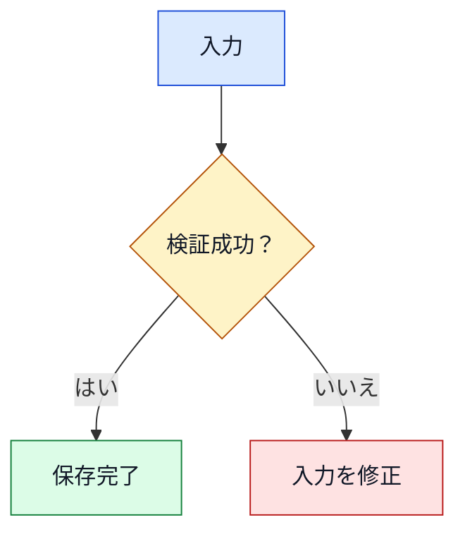

# Mermaid design rules

Use Mermaid when a visual relationship is materially clearer than prose or a pipe table. State the figure's purpose in the surrounding text.

## Select the diagram type

| Information to explain | Diagram type | Use its native entities |
|---|---|---|
| Process, decisions, responsibilities | `flowchart` | nodes, edges, decision shapes, labels, `subgraph` |
| Communication over time | `sequenceDiagram` | `actor`, `participant`, messages, activation, `note`, `alt`, `opt`, `loop`, `par` |
| Lifecycle and transitions | `stateDiagram-v2` | start/end, states, transitions, `choice`, `fork`, `join`, composite states |
| Data model | `erDiagram` | entities, attributes, PK/FK, relationships, cardinality |
| Types and dependencies | `classDiagram` | classes, interfaces, members, inheritance, composition, aggregation, dependency |
| Schedule and dependencies | `gantt` | sections, tasks, milestones, dates, dependencies |
| Requirement traceability | `requirementDiagram` | requirements, elements, risk, verification method, relationship types |
| User experience over stages | `journey` | sections, tasks, satisfaction scores, actors |

Do not force a diagram type merely for variety. Prefer stable Mermaid syntax supported by the target VS Code version. Avoid experimental syntax unless the user requests it and preview confirms support.

## Build swimlanes safely

Represent swimlanes with `flowchart` subgraphs by default. Use one lane dimension only: people, departments, or systems. Label handoffs with the artifact, event, or condition being transferred.

Use `swimlane-beta` only when the installed Mermaid version is known to support it and the user accepts experimental syntax.

## Apply semantic styling

Use color consistently by meaning, not decoration:

| Meaning | Fill | Stroke |
|---|---|---|
| Actor, input, external party | blue `#DBEAFE` | `#1D4ED8` |
| Normal process or system | light blue `#E0F2FE` | `#0369A1` |
| Decision, check, caution | yellow `#FEF3C7` | `#B45309` |
| Completion, approval, success | green `#DCFCE7` | `#15803D` |
| Error, rejection, major risk | red `#FEE2E2` | `#B91C1C` |

For flowcharts, define reusable classes and assign every meaning-bearing node:

Preserve semantics if a diagram type offers limited styling. Do not rely on color alone; combine color with shape, label, relationship, or status text. Maintain strong text contrast in light and dark VS Code themes.

## Keep diagrams readable and safe

- Add `accTitle` and `accDescr` to each diagram.
- Use short ASCII node IDs and concise Japanese display labels.
- Quote labels containing punctuation, parentheses, or other syntax-sensitive characters.
- Label non-obvious edges, branches, messages, and handoffs.
- Keep at most five nodes or participants across one horizontal row; switch to top-down layout or split the figure when larger.
- Separate overview and detail diagrams instead of creating one dense figure.
- Keep prose and diagram terminology identical.
- Do not use HTML labels, `click`, external scripts, external icons, remote images, or Mermaid `init`/`config` directives.
- Preview in VS Code. If rendering fails, simplify to stable syntax before removing useful meaning.
