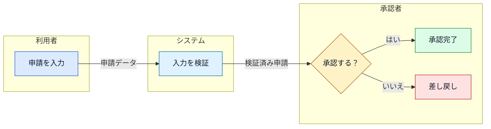
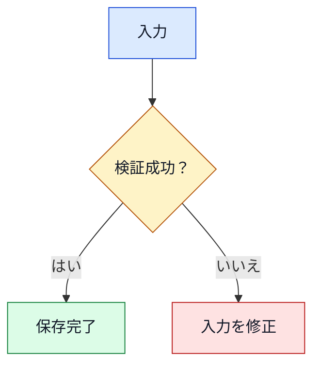

# Mermaid作図規約

関係を文章やパイプ形式の表より明確に視覚化できる場合にMermaidを使用する。図の前後の本文で、その図の目的を説明する。

## 図種を選択する

| 説明する情報 | 図種 | 活用する固有要素 |
|---|---|---|
| 処理、判断、責任分担 | `flowchart` | ノード、エッジ、判断形状、ラベル、`subgraph` |
| 時系列の通信 | `sequenceDiagram` | `actor`、`participant`、メッセージ、アクティベーション、`note`、`alt`、`opt`、`loop`、`par` |
| ライフサイクルと遷移 | `stateDiagram-v2` | 開始・終了、状態、遷移、`choice`、`fork`、`join`、複合状態 |
| データモデル | `erDiagram` | エンティティ、属性、PK・FK、関係、カーディナリティ |
| 型と依存関係 | `classDiagram` | クラス、インターフェース、メンバー、継承、コンポジション、集約、依存 |
| スケジュールと依存関係 | `gantt` | セクション、タスク、マイルストーン、日付、依存関係 |
| 要件のトレーサビリティ | `requirementDiagram` | 要件、要素、リスク、検証方法、関係種別 |
| 段階ごとのユーザー体験 | `journey` | セクション、タスク、満足度、アクター |

見た目の変化だけを目的に図種を選択しない。対象のVS Codeバージョンが対応する安定したMermaid構文を優先する。ユーザーが求め、プレビューで対応を確認できた場合を除き、実験的な構文を避ける。

## スイムレーンを安全に作成する

標準では`flowchart`のサブグラフでスイムレーンを表現する。レーンを分ける軸は、担当者、部署、システムのいずれか1種類にする。担当間の引き渡しには、受け渡す成果物、イベント、条件のラベルを付ける。

インストール済みのMermaidバージョンが対応し、ユーザーが実験的な構文を了承した場合だけ`swimlane-beta`を使用する。

## 意味に基づいて装飾する

装飾ではなく意味に基づいて色を一貫して使用する。

| 意味 | 塗り | 枠線 |
|---|---|---|
| アクター、入力、外部主体 | 青 `#DBEAFE` | `#1D4ED8` |
| 通常処理、システム | 水色 `#E0F2FE` | `#0369A1` |
| 判断、確認、注意 | 黄 `#FEF3C7` | `#B45309` |
| 完了、承認、成功 | 緑 `#DCFCE7` | `#15803D` |
| エラー、却下、重大リスク | 赤 `#FEE2E2` | `#B91C1C` |

フローチャートでは再利用可能なクラスを定義し、意味を持つすべてのノードへ割り当てる。

図種の装飾機能が限られる場合も意味を保持する。色だけに依存せず、形状、ラベル、関係、状態を示す文字列と組み合わせる。VS Codeのライトテーマとダークテーマの両方で、文字のコントラストを十分に保つ。

## 図を読みやすく安全に保つ

- 各図に`accTitle`と`accDescr`を追加する。
- 短いASCIIノードIDと簡潔な日本語の表示ラベルを使用する。
- 句読点、括弧、その他の構文に影響する文字を含むラベルは引用符で囲む。
- 意味が明らかでないエッジ、分岐、メッセージ、引き渡しにはラベルを付ける。
- 横一列のノードまたは参加者を5つ以内にする。それを超える場合は上から下の配置へ変更するか、図を分割する。
- 1つの過密な図を作らず、概要図と詳細図に分ける。
- 本文と図の用語を一致させる。
- HTMLラベル、`click`、外部スクリプト、外部アイコン、リモート画像、Mermaidの`init`・`config`ディレクティブを使用しない。
- VS Codeでプレビューする。描画に失敗した場合は、有用な意味を削る前に安定した構文へ簡素化する。
